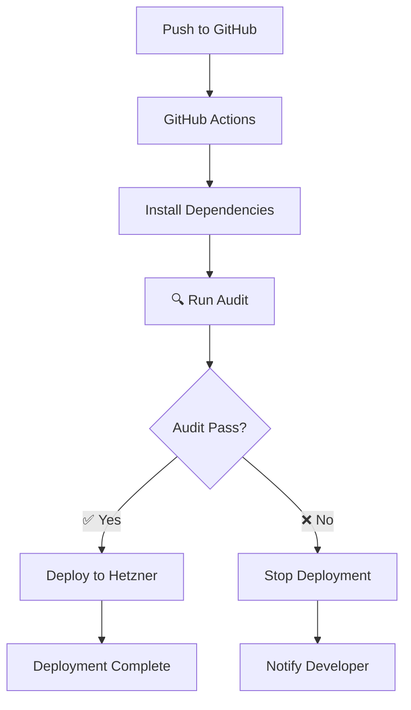

# 🔍 Sistema de Auditoría Pre-Deployment - INMOVA

## 📋 Índice

1. [Visión General](#visión-general)
2. [¿Por Qué Es Necesaria Esta Auditoría?](#por-qué-es-necesaria-esta-auditoría)
3. [Componentes del Sistema](#componentes-del-sistema)
4. [Validaciones Realizadas](#validaciones-realizadas)
5. [Cómo Usar el Sistema](#cómo-usar-el-sistema)
6. [Integración con GitHub Actions](#integración-con-github-actions)
7. [Interpretación de Resultados](#interpretación-de-resultados)
8. [Resolución de Problemas Comunes](#resolución-de-problemas-comunes)
9. [Best Practices](#best-practices)

---

## 🎯 Visión General

El **Sistema de Auditoría Pre-Deployment** es una herramienta automatizada que realiza verificaciones comprehensivas del código antes de cada deployment, garantizando que:

- ✅ No haya errores críticos que puedan causar fallos en producción
- ✅ Todos los archivos necesarios estén presentes
- ✅ Las dependencias y módulos estén correctamente configurados
- ✅ El schema de Prisma sea válido y consistente
- ✅ No haya archivos problemáticos (muy grandes, temporales, etc.)

---

## ❓ ¿Por Qué Es Necesaria Esta Auditoría?

### Problemas Históricos Evitados

Este sistema fue diseñado para prevenir problemas como los que experimentamos anteriormente:

#### 1. **Prisma Schema Errors** ❌

**Problema**: Índices referenciando campos inexistentes

```prisma
model Building {
  // ...
  @@index([companyId, activo])  // ❌ Campo 'activo' no existe
}
```

**Solución**: La auditoría verifica que todos los índices referencien campos válidos.

#### 2. **Missing Modules** ❌

**Problema**: Imports a módulos inexistentes

```typescript
import { prisma } from '@/lib/prisma'; // ❌ Archivo lib/prisma.ts no existe
```

**Solución**: La auditoría verifica que todos los módulos comunes existan.

#### 3. **Large Files** ❌

**Problema**: Archivos >100MB en el repositorio

```bash
remote: error: File core is 2.2GB; exceeds GitHub's 100MB limit
```

**Solución**: La auditoría detecta archivos grandes antes del commit.

#### 4. **Missing Critical Files** ❌

**Problema**: Archivos esenciales eliminados accidentalmente

```bash
Error: Cannot find module 'middleware.ts'
```

**Solución**: La auditoría verifica que todos los archivos críticos existan.

---

## 🔧 Componentes del Sistema

### 1. Script de Auditoría

**Ubicación**: `scripts/pre-deployment-audit.ts`

Script TypeScript ejecutable que realiza 8 categorías de validaciones.

### 2. GitHub Actions Workflow

**Ubicación**: `.github/workflows/deploy-hetzner.yml`

Workflow automatizado que ejecuta la auditoría antes de cada deployment.

### 3. NPM Script

**Ubicación**: `package.json`

```json
{
  "scripts": {
    "audit:deployment": "tsx scripts/pre-deployment-audit.ts"
  }
}
```

---

## 🔍 Validaciones Realizadas

### 1. Prisma Schema Validation 🗄️

**¿Qué verifica?**

- ✅ Sintaxis válida del schema
- ✅ Índices referencian campos existentes
- ✅ Relaciones son consistentes

**Ejemplo de error detectado**:

```
🚨 ERROR: Modelo Building: índice referencia campo inexistente 'activo'
💡 Recomendación: Eliminar el índice o crear el campo 'activo'
```

### 2. Archivos Críticos 📁

**Archivos verificados**:

- ✅ `middleware.ts` (requerido)
- ✅ `next.config.js` (requerido)
- ✅ `package.json` (requerido)
- ✅ `tsconfig.json` (requerido)
- ⚠️ `.env` (opcional)
- ✅ `lib/db.ts` (requerido)
- ✅ `lib/auth-options.ts` (requerido)

### 3. Variables de Entorno 🔐

**Variables requeridas**:

- ✅ `DATABASE_URL`
- ✅ `NEXTAUTH_SECRET`
- ✅ `NEXTAUTH_URL`

**Variables opcionales**:

- ℹ️ `AWS_BUCKET_NAME`
- ℹ️ `AWS_FOLDER_PREFIX`
- ℹ️ `STRIPE_SECRET_KEY`
- ℹ️ `STRIPE_PUBLISHABLE_KEY`

### 4. Imports y Módulos 📦

**Módulos verificados**:

- ✅ `lib/prisma.ts` (usado en imports `@/lib/prisma`)
- ✅ `lib/db.ts` (usado en imports `@/lib/db`)
- ✅ `lib/auth-options.ts` (usado en NextAuth)

### 5. TypeScript Compilation ⚙️

**¿Qué verifica?**

- ⚠️ Errores de tipos TypeScript
- ⚠️ Imports inválidos
- ⚠️ Sintaxis incorrecta

**Nota**: Los errores de TypeScript generan WARNING, no ERROR.

### 6. Archivos Grandes 📊

**¿Qué verifica?**

- 🚨 Archivos >100MB (límite de GitHub)
- 🚨 Archivos `core` (dumps de memoria)
- ⚠️ Archivos `.log` grandes

### 7. Dependencias 📚

**¿Qué verifica?**

- ✅ `package.json` es válido JSON
- ✅ Scripts necesarios existen (`dev`, `build`, `start`)
- ✅ Dependencias están instaladas

### 8. API Routes 🌐

**¿Qué verifica?**

- ℹ️ Cuenta el número de API routes
- ℹ️ Verifica que el directorio `app/api` existe

---

## 🚀 Cómo Usar el Sistema

### Ejecución Manual

#### 1. Ejecutar auditoría localmente

```bash
cd /home/ubuntu/homming_vidaro/nextjs_space
yarn audit:deployment
```

#### 2. Interpretar resultados

**✅ Auditoría exitosa**:

```
✅ ¡EXCELENTE! No se encontraron problemas.
   El proyecto está listo para deployment.
```

**⚠️ Con advertencias**:

```
⚠️  AUDITORÍA COMPLETADA CON ADVERTENCIAS
   Se recomienda revisar las advertencias antes de hacer deployment.
```

**❌ Con errores**:

```
❌ AUDITORÍA FALLIDA
   Por favor, corrija los errores críticos antes de hacer deployment.
```

### Ejecución Automática

La auditoría se ejecuta automáticamente en GitHub Actions antes de cada deployment:

```yaml
- name: Run Pre-Deployment Audit
  run: yarn audit:deployment
```

Si la auditoría falla, el deployment se detiene automáticamente.

---

## 🔄 Integración con GitHub Actions

### Workflow Actualizado

```yaml
name: Deploy to Hetzner

on:
  push:
    branches:
      - main

jobs:
  deploy:
    runs-on: ubuntu-latest
    steps:
      - name: Checkout code
        uses: actions/checkout@v3

      - name: Setup Node.js
        uses: actions/setup-node@v3
        with:
          node-version: '18'

      - name: Install dependencies
        run: |
          cd nextjs_space
          yarn install --frozen-lockfile

      # 🔍 AUDITORÍA PRE-DEPLOYMENT
      - name: Run Pre-Deployment Audit
        run: |
          cd nextjs_space
          yarn audit:deployment

      # Si la auditoría pasa, continuar con deployment
      - name: Deploy to Hetzner
        # ... resto del deployment
```

### Flujo de Trabajo



---

## 📊 Interpretación de Resultados

### Niveles de Severidad

#### 🚨 ERROR (Crítico)

- **Descripción**: Problemas que IMPEDIRÁN el funcionamiento en producción
- **Acción**: DEBE ser corregido antes del deployment
- **Ejemplos**:
  - Schema Prisma inválido
  - Archivos críticos faltantes
  - Archivos >100MB
  - Variables de entorno requeridas faltantes

#### ⚠️ WARNING (Advertencia)

- **Descripción**: Problemas que PUEDEN causar issues en producción
- **Acción**: DEBERÍA ser revisado antes del deployment
- **Ejemplos**:
  - Errores de TypeScript
  - Archivos .env faltantes
  - Scripts de package.json faltantes

#### ℹ️ INFO (Información)

- **Descripción**: Información útil, no requiere acción inmediata
- **Acción**: Opcional
- **Ejemplos**:
  - Variables de entorno opcionales no configuradas
  - Número de API routes encontradas

### Ejemplo de Reporte Completo

```
═══════════════════════════════════════════════════════════════════════════════
📋 REPORTE DE AUDITORÍA PRE-DEPLOYMENT
═══════════════════════════════════════════════════════════════════════════════

🚨 ERRORES CRÍTICOS (2):
────────────────────────────────────────────────────────────────────────────────

1. [Prisma] Modelo Building: índice referencia campo inexistente 'activo'
   📄 Archivo: prisma/schema.prisma
   💡 Recomendación: Eliminar el índice o crear el campo 'activo' en el modelo Building

2. [Imports] Módulo lib/prisma.ts no existe pero puede ser importado como @/lib/prisma
   📄 Archivo: lib/prisma.ts
   💡 Recomendación: Crear el archivo lib/prisma.ts o actualizar los imports

⚠️  ADVERTENCIAS (1):
────────────────────────────────────────────────────────────────────────────────

1. [TypeScript] Hay errores de TypeScript en el código
   💡 Recomendación: Ejecutar `yarn tsc --noEmit` para ver errores detallados

═══════════════════════════════════════════════════════════════════════════════
📊 RESUMEN:
   • Errores: 2
   • Advertencias: 1
   • Información: 0
═══════════════════════════════════════════════════════════════════════════════

❌ AUDITORÍA FALLIDA
   Por favor, corrija los errores críticos antes de hacer deployment.
```

---

## 🛠️ Resolución de Problemas Comunes

### Error: Prisma Schema Inválido

**Síntoma**:

```
🚨 ERROR: Schema Prisma contiene errores de sintaxis
```

**Solución**:

```bash
cd /home/ubuntu/homming_vidaro/nextjs_space
yarn prisma validate
# Revisar y corregir errores mostrados
```

---

### Error: Índice Referencia Campo Inexistente

**Síntoma**:

```
🚨 ERROR: Modelo Building: índice referencia campo inexistente 'activo'
```

**Solución 1**: Eliminar el índice

```prisma
model Building {
  // ...
  // @@index([companyId, activo])  // ❌ Eliminar esta línea
  @@index([companyId])  // ✅ Usar solo campos existentes
}
```

**Solución 2**: Crear el campo

```prisma
model Building {
  // ...
  activo Boolean @default(true)  // ✅ Crear el campo
  @@index([companyId, activo])  // ✅ Ahora el índice es válido
}
```

---

### Error: Módulo No Encontrado

**Síntoma**:

```
🚨 ERROR: Módulo lib/prisma.ts no existe
```

**Solución**: Crear el archivo faltante

```typescript
// lib/prisma.ts
export { prisma, db } from './db';
export { default } from './db';
```

---

### Error: Archivo Grande

**Síntoma**:

```
🚨 ERROR: Archivo core excede 100MB (2200MB)
```

**Solución**:

```bash
# 1. Agregar a .gitignore
echo "core" >> .gitignore

# 2. Eliminar del repositorio
rm core

# 3. Si ya está en Git
git rm --cached core
git commit -m "Remove large core file"
```

---

### Warning: Errores de TypeScript

**Síntoma**:

```
⚠️  WARNING: Hay errores de TypeScript en el código
```

**Solución**:

```bash
# Ver errores detallados
yarn tsc --noEmit

# Corregir errores de tipos
# Nota: Esto es un WARNING, no bloqueará el deployment
```

---

## 📚 Best Practices

### 1. Ejecutar Auditoría Antes de Cada Commit

```bash
# Crear Git hook
cat > .git/hooks/pre-commit << 'EOF'
#!/bin/sh
cd nextjs_space
yarn audit:deployment
EOF

chmod +x .git/hooks/pre-commit
```

### 2. Integrar en CI/CD Pipeline

Asegurarse de que la auditoría es parte del pipeline:

```yaml
# .github/workflows/ci.yml
jobs:
  audit:
    runs-on: ubuntu-latest
    steps:
      - uses: actions/checkout@v3
      - name: Audit
        run: |
          cd nextjs_space
          yarn install
          yarn audit:deployment
```

### 3. Revisar Resultados Regularmente

Incluso si no hay errores, revisar warnings periódicamente:

```bash
# Ver solo warnings
yarn audit:deployment | grep "WARNING"
```

### 4. Mantener .gitignore Actualizado

Agregar patrones para evitar archivos problemáticos:

```gitignore
# Archivos temporales
core
*.log
*.tmp

# Archivos grandes
*.zip
*.tar.gz
*.mp4
*.mov

# Dependencias
node_modules/
.next/
```

### 5. Documentar Cambios en Schema

Cuando se modifica el schema de Prisma:

```bash
# 1. Hacer cambios
vim prisma/schema.prisma

# 2. Validar
yarn prisma validate

# 3. Auditar
yarn audit:deployment

# 4. Si todo OK, generar cliente
yarn prisma generate
```

---

## 📞 Soporte

### Contacto

- **Email**: soporte@inmova.app
- **Web**: https://www.inmova.app

### Recursos Adicionales

- [Documentación de Prisma](https://www.prisma.io/docs)
- [Next.js Deployment](https://nextjs.org/docs/deployment)
- [GitHub Actions](https://docs.github.com/en/actions)

---

## 📝 Changelog

### v1.0.0 (Diciembre 2024)

- ✅ Sistema inicial de auditoría
- ✅ 8 categorías de validación
- ✅ Integración con GitHub Actions
- ✅ Documentación completa

---

## 🏆 Conclusión

El Sistema de Auditoría Pre-Deployment es una herramienta esencial para garantizar la calidad y estabilidad de los deployments. Al detectar problemas antes de que lleguen a producción, ahorramos tiempo, evitamos downtime y mejoramos la experiencia del usuario final.

**Recuerda**: Un deployment exitoso comienza con una buena auditoría. 🚀
