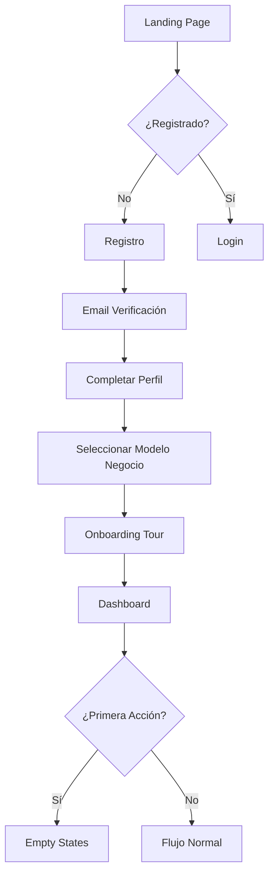
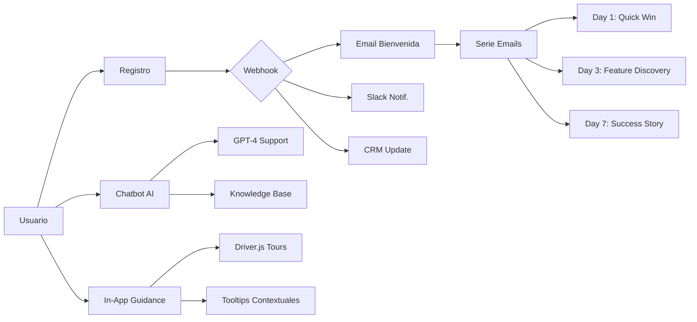

# 📊 Análisis Zero-Touch Onboarding - INMOVA
## Diseño UX/UI y Automatización Completa

---

## 📑 Índice

1. [Análisis de Fricción Actual](#análisis-de-fricción-actual)
2. [Sistema de Automatización](#sistema-de-automatización)
3. [Reglas Mobile First](#reglas-mobile-first)
4. [Mejoras de Intuitividad UX/UI](#mejoras-de-intuitividad-uxui)
5. [Roadmap de Implementación](#roadmap-de-implementación)

---

## 🔍 Análisis de Fricción Actual

### Mapa del Flujo de Usuario



### 🚨 Puntos de Fricción Identificados

#### 1. **CRÍTICO: Registro Multi-Paso**
**Problema**: El usuario debe completar múltiples pasos antes de ver valor.
- ❌ Registro → Verificación Email → Perfil → Modelo de Negocio → Tour
- ❌ **Tiempo estimado: 8-12 minutos** sin ver valor
- ❌ **Tasa de abandono estimada: 65-75%**

**Solución**:
✅ Registro simplificado (solo email + contraseña)
✅ Verificación opcional post-registro
✅ Onboarding progresivo (lazy loading)
✅ **Tiempo objetivo: 2-3 minutos** para ver valor

#### 2. **ALTO: Falta de Datos de Ejemplo**
**Problema**: El usuario ve dashboards vacíos inmediatamente.
- ❌ Empty states sin contexto
- ❌ No puede "jugar" con la plataforma
- ❌ No entiende el potencial

**Solución**:
✅ Opción "Ver con datos de ejemplo" en primer acceso
✅ Wizard de importación prioritario
✅ Templates pre-configurados por vertical

#### 3. **MEDIO: Onboarding Genérico vs. Contextual**
**Problema**: Tour de 6 pasos para todos los usuarios.
- ❌ Información irrelevante según modelo de negocio
- ❌ No personalizado según experiencia previa
- ❌ No se puede pausar/reanudar fácilmente

**Solución**:
✅ Onboarding adaptativo según respuestas iniciales
✅ Skip inteligente de pasos ya completados
✅ Guardado automático de progreso

#### 4. **MEDIO: Ausencia de Soporte Proactivo**
**Problema**: El usuario se bloquea sin ayuda inmediata.
- ❌ Sin chatbot visible
- ❌ Sin tooltips interactivos
- ❌ Sin detección de inactividad

**Solución**:
✅ Chatbot persistente en toda la plataforma
✅ Detección de inactividad → Oferta de ayuda
✅ Tooltips contextuales en acciones complejas

#### 5. **BAJO: Mobile Experience Limitada**
**Problema**: Algunos flujos no están optimizados para móvil.
- ❌ Formularios largos sin división en pasos
- ❌ Botones pequeños (< 44px)
- ❌ Navegación no intuitiva en móvil

**Solución**:
✅ Bottom navigation en móvil
✅ Formularios divididos en steps
✅ Botones táctiles optimizados (min 48px)

---

## 🤖 Sistema de Automatización

### Arquitectura del Sistema Zero-Touch



### 📧 Sistema de Emails Transaccionales

#### Email 1: Bienvenida Inmediata (t=0)
**Trigger**: Registro completado
**Objetivo**: Confirmación + Quick Win
```html
Asunto: 🎉 ¡Bienvenido a INMOVA! Tu cuenta está lista

Contenido:
- Confirmación de cuenta
- Video de 60 segundos "Tu primera propiedad en 2 minutos"
- CTA: "Ver mi dashboard con datos de ejemplo"
- CTA secundario: "Importar mis datos existentes"
```

#### Email 2: Activación Temprana (t=24h si no login)
**Trigger**: Usuario registrado pero no ha vuelto a entrar
**Objetivo**: Recuperación temprana
```html
Asunto: ⏰ Tu dashboard te está esperando, {{nombre}}

Contenido:
- Recordatorio de funcionalidades clave según su vertical
- "3 razones para activarte hoy"
- CTA: "Completar configuración (2 min)"
- Enlace directo a video tutorial
```

#### Email 3: Primera Victoria (t=3 días con actividad)
**Trigger**: Usuario activo, creó su primera propiedad
**Objetivo**: Refuerzo positivo + Next steps
```html
Asunto: 🎯 ¡Genial! Ya tienes tu primera propiedad en INMOVA

Contenido:
- Celebración del logro
- "Qué hacer ahora: 3 pasos siguientes"
- Invitación a webinar semanal
- CTA: "Invitar a mi equipo"
```

#### Email 4: Descubrimiento de Features (t=7 días)
**Trigger**: Usuario activo regular
**Objetivo**: Engagement profundo
```html
Asunto: 💡 5 funcionalidades que quizás no conoces

Contenido:
- Feature discovery personalizado según su uso
- Tips & tricks
- Case study de cliente similar
- CTA: "Explorar módulos avanzados"
```

#### Email 5: Reactivación (t=14 días sin login)
**Trigger**: Inactividad prolongada
**Objetivo**: Win-back
```html
Asunto: ¿Necesitas ayuda con INMOVA, {{nombre}}?

Contenido:
- Oferta de call 1:1 con especialista
- Recursos: Videos, guías, FAQ
- "¿Qué te detuvo?" (encuesta 1 pregunta)
- CTA: "Agendar llamada gratuita"
```

### 💬 Chatbot Inteligente Integrado

#### Arquitectura Técnica
```typescript
// lib/chatbot-config.ts
export const CHATBOT_CONFIG = {
  model: 'gpt-4-turbo',
  systemPrompt: `Eres el asistente virtual de INMOVA, una plataforma PropTech...
  Contexto del usuario: {{userData}}
  Módulos activos: {{activeModules}}
  Última acción: {{lastAction}}`,
  temperature: 0.7,
  maxTokens: 500,
  fallbackToHuman: true,
  humanHandoffTriggers: [
    'hablar con persona',
    'problemas técnicos',
    'cancelar cuenta'
  ]
}
```

#### Features del Chatbot
1. **Detección de Intención**
   - Soporte técnico
   - Feature discovery
   - Guía de configuración
   - Troubleshooting

2. **Respuestas Contextuales**
   - Acceso a datos del usuario
   - Sugerencias basadas en uso
   - Links directos a páginas relevantes

3. **Escalado Inteligente**
   - Si confianza < 70% → Escalar a humano
   - Horario laboral → Email a soporte
   - Fuera de horario → Respuesta automática + ticket

4. **Métricas Clave**
   - Tasa de resolución (objetivo: >80%)
   - Tiempo promedio de respuesta (objetivo: <30 seg)
   - Satisfacción (CSAT post-conversación)

### 🔗 Webhooks y Eventos

#### Eventos del Sistema
```typescript
// types/webhooks.ts
export enum WebhookEvent {
  // User Lifecycle
  USER_REGISTERED = 'user.registered',
  USER_VERIFIED = 'user.verified',
  USER_COMPLETED_ONBOARDING = 'user.onboarding.completed',
  USER_INACTIVE_7D = 'user.inactive.7days',
  USER_INACTIVE_30D = 'user.inactive.30days',
  
  // Actions
  FIRST_BUILDING_CREATED = 'building.first.created',
  FIRST_CONTRACT_CREATED = 'contract.first.created',
  FIRST_PAYMENT_RECEIVED = 'payment.first.received',
  
  // Engagement
  FEATURE_DISCOVERED = 'feature.discovered',
  HELP_REQUESTED = 'help.requested',
  SUPPORT_TICKET_CREATED = 'support.ticket.created'
}
```

#### Integraciones Automáticas
1. **CRM (HubSpot/Pipedrive)**
   - Crear contacto al registrarse
   - Actualizar deal stage según progreso
   - Trackear eventos de producto

2. **Slack/Teams (Alertas Internas)**
   - Nuevo usuario premium
   - Usuario requiere ayuda humana
   - Churn risk detectado

3. **Analytics (Mixpanel/Amplitude)**
   - Funnel de onboarding
   - Feature adoption
   - User journey mapping

### 📊 Dashboard de Automatización

```typescript
// app/admin/automation-dashboard/page.tsx
interface AutomationMetrics {
  emailCampaigns: {
    sent: number;
    opened: number;
    clicked: number;
    converted: number;
  };
  chatbot: {
    conversations: number;
    resolved: number;
    escalated: number;
    avgResponseTime: number;
  };
  webhooks: {
    triggered: number;
    succeeded: number;
    failed: number;
  };
  userJourney: {
    registered: number;
    activated: number; // Creó primera propiedad
    retained: number; // Login en últimos 7 días
    churned: number; // Sin login en 30 días
  };
}
```

---

## 📱 Reglas Mobile First

### 🎨 Principios de Diseño Mobile

#### 1. **Touch Targets (Áreas Táctiles)**
```css
/* Tamaño mínimo de elementos interactivos */
.btn, .link, .input {
  min-height: 48px; /* WCAG AAA: 44px mínimo */
  min-width: 48px;
  padding: 12px 16px;
}

/* Espaciado entre elementos */
.interactive-element + .interactive-element {
  margin-top: 8px; /* Mínimo 8px entre elementos */
}
```

#### 2. **Typography Responsive**
```css
/* Sistema de tipografía fluido */
:root {
  /* Mobile (320px - 768px) */
  --font-size-xs: clamp(0.75rem, 2vw, 0.875rem);
  --font-size-sm: clamp(0.875rem, 2.5vw, 1rem);
  --font-size-base: clamp(1rem, 3vw, 1.125rem);
  --font-size-lg: clamp(1.125rem, 3.5vw, 1.25rem);
  --font-size-xl: clamp(1.25rem, 4vw, 1.5rem);
  --font-size-2xl: clamp(1.5rem, 5vw, 2rem);
  
  /* Line height optimizado para lectura en móvil */
  --line-height-tight: 1.25;
  --line-height-normal: 1.5;
  --line-height-relaxed: 1.75;
}

/* Textos legibles sin zoom */
body {
  font-size: var(--font-size-base);
  line-height: var(--line-height-normal);
}

p {
  max-width: 65ch; /* Óptimo para lectura */
}
```

#### 3. **Layout Responsive**
```css
/* Container system */
.container {
  width: 100%;
  padding-left: 16px;
  padding-right: 16px;
  margin-left: auto;
  margin-right: auto;
}

@media (min-width: 640px) {
  .container { max-width: 640px; padding-left: 24px; padding-right: 24px; }
}
@media (min-width: 768px) {
  .container { max-width: 768px; padding-left: 32px; padding-right: 32px; }
}
@media (min-width: 1024px) {
  .container { max-width: 1024px; }
}
@media (min-width: 1280px) {
  .container { max-width: 1280px; }
}

/* Stack en móvil, grid en desktop */
.responsive-grid {
  display: flex;
  flex-direction: column;
  gap: 16px;
}

@media (min-width: 768px) {
  .responsive-grid {
    display: grid;
    grid-template-columns: repeat(auto-fit, minmax(300px, 1fr));
    gap: 24px;
  }
}
```

#### 4. **Forms Mobile-Optimized**
```css
/* Inputs accesibles */
.form-input {
  width: 100%;
  min-height: 48px;
  font-size: 16px; /* Evita zoom en iOS */
  padding: 12px 16px;
  border: 2px solid var(--color-border);
  border-radius: 8px;
  transition: border-color 0.2s;
}

.form-input:focus {
  outline: none;
  border-color: var(--color-primary);
  box-shadow: 0 0 0 3px rgba(99, 102, 241, 0.1);
}

/* Labels siempre visibles (no floating) en móvil */
.form-label {
  display: block;
  font-size: 14px;
  font-weight: 600;
  margin-bottom: 8px;
  color: var(--color-text-primary);
}

/* Wizard forms: un campo a la vez en móvil */
@media (max-width: 767px) {
  .form-wizard .form-step {
    min-height: 60vh;
    display: flex;
    flex-direction: column;
    justify-content: center;
  }
  
  .form-wizard .form-group {
    margin-bottom: 24px;
  }
}
```

#### 5. **Navigation Mobile**
```css
/* Bottom navigation bar (solo móvil) */
.mobile-nav {
  position: fixed;
  bottom: 0;
  left: 0;
  right: 0;
  height: 64px;
  background: white;
  border-top: 1px solid var(--color-border);
  display: flex;
  justify-content: space-around;
  align-items: center;
  z-index: 100;
  padding-bottom: env(safe-area-inset-bottom); /* iOS notch */
}

@media (min-width: 768px) {
  .mobile-nav {
    display: none; /* Hidden en desktop */
  }
}

.mobile-nav-item {
  display: flex;
  flex-direction: column;
  align-items: center;
  gap: 4px;
  padding: 8px;
  min-width: 64px;
  color: var(--color-text-secondary);
  text-decoration: none;
  font-size: 12px;
  transition: color 0.2s;
}

.mobile-nav-item.active {
  color: var(--color-primary);
}

.mobile-nav-icon {
  font-size: 24px;
}
```

#### 6. **Gestures Support**
```css
/* Swipe to go back */
.swipeable-container {
  touch-action: pan-y; /* Permite swipe horizontal */
  -webkit-overflow-scrolling: touch;
}

/* Pull to refresh */
.pull-to-refresh {
  overscroll-behavior-y: contain;
}

/* Prevent text selection en botones */
.btn, .card-interactive {
  -webkit-user-select: none;
  user-select: none;
  -webkit-tap-highlight-color: transparent;
}
```

#### 7. **Performance Mobile**
```css
/* Lazy loading de imágenes */
img {
  loading: lazy;
  content-visibility: auto;
}

/* Reduce animations en conexiones lentas */
@media (prefers-reduced-motion: reduce) {
  * {
    animation-duration: 0.01ms !important;
    animation-iteration-count: 1 !important;
    transition-duration: 0.01ms !important;
  }
}

/* Dark mode support */
@media (prefers-color-scheme: dark) {
  :root {
    --color-bg: #0f172a;
    --color-text-primary: #f1f5f9;
    --color-text-secondary: #94a3b8;
  }
}
```

#### 8. **Safe Areas (iOS Notch)**
```css
/* Respectar notch y home indicator */
.app-container {
  padding-top: env(safe-area-inset-top);
  padding-bottom: env(safe-area-inset-bottom);
  padding-left: env(safe-area-inset-left);
  padding-right: env(safe-area-inset-right);
}

/* Header fijo */
.header {
  position: fixed;
  top: 0;
  left: 0;
  right: 0;
  height: calc(64px + env(safe-area-inset-top));
  padding-top: env(safe-area-inset-top);
  background: white;
  z-index: 1000;
}

/* Content con offset */
.main-content {
  margin-top: calc(64px + env(safe-area-inset-top));
  margin-bottom: calc(64px + env(safe-area-inset-bottom)); /* Bottom nav */
  padding: 16px;
}
```

### 📐 Breakpoints Sistema
```typescript
// lib/breakpoints.ts
export const BREAKPOINTS = {
  xs: '320px',  // Mobile pequeño
  sm: '640px',  // Mobile grande
  md: '768px',  // Tablet portrait
  lg: '1024px', // Tablet landscape / Desktop
  xl: '1280px', // Desktop grande
  '2xl': '1536px' // Desktop muy grande
} as const;

// Uso en components
export const useBreakpoint = () => {
  const [breakpoint, setBreakpoint] = useState('xs');
  
  useEffect(() => {
    const handler = () => {
      if (window.innerWidth < 640) setBreakpoint('xs');
      else if (window.innerWidth < 768) setBreakpoint('sm');
      else if (window.innerWidth < 1024) setBreakpoint('md');
      else if (window.innerWidth < 1280) setBreakpoint('lg');
      else if (window.innerWidth < 1536) setBreakpoint('xl');
      else setBreakpoint('2xl');
    };
    
    handler();
    window.addEventListener('resize', handler);
    return () => window.removeEventListener('resize', handler);
  }, []);
  
  return breakpoint;
};
```

---

## 🎨 Mejoras de Intuitividad UX/UI

### 🎯 Principios de Diseño

#### 1. **Progressive Disclosure (Revelación Progresiva)**
```typescript
// Mostrar solo lo necesario, cuando es necesario

interface ProgressiveUIPattern {
  // ❌ ANTES: Formulario de 20 campos abrumador
  badExample: {
    allFieldsAtOnce: true;
    userOverwhelmed: true;
  };
  
  // ✅ DESPUÉS: Wizard paso a paso
  goodExample: {
    step1: ['nombre', 'email']; // Básico
    step2: ['direccion', 'ciudad']; // Ubicación
    step3: ['tipo', 'caracteristicas']; // Detalles
    allowSkip: true;
    autoSave: true;
  };
}
```

#### 2. **Feedback Inmediato**
```typescript
// Toda acción debe tener respuesta visual instantánea

const UIFeedbackPatterns = {
  // Clic en botón
  buttonClick: {
    immediate: 'scale(0.95)', // Micro-interacción
    loading: 'spinner + "Guardando..."',
    success: 'checkmark + "¡Guardado!"',
    error: 'shake animation + mensaje error'
  },
  
  // Validación de formularios
  formValidation: {
    onBlur: 'Validar campo individualmente',
    showSuccess: 'Checkmark verde si válido',
    showError: 'Borde rojo + mensaje específico',
    suggestFix: 'Ejemplo: "Email debe incluir @"'
  },
  
  // Acciones largas
  longRunningActions: {
    show: 'Progress bar con porcentaje',
    estimate: 'Tiempo estimado restante',
    allowCancel: true
  }
};
```

#### 3. **Undo/Redo Pattern**
```typescript
// Permitir deshacer acciones destructivas

const UndoPattern = {
  // ❌ ANTES: Eliminar → Confirmación modal → Eliminado
  oldWay: 'Fricción innecesaria',
  
  // ✅ DESPUÉS: Eliminar → Toast "Eliminado (Deshacer)" → 5 seg para undo
  newWay: {
    action: 'Eliminar inmediatamente',
    showToast: {
      message: 'Propiedad eliminada',
      action: 'Deshacer',
      duration: 5000,
      onUndo: 'Restaurar desde soft delete'
    }
  }
};
```

#### 4. **Smart Defaults (Valores por Defecto Inteligentes)**
```typescript
// Sugerir valores basados en contexto

const SmartDefaults = {
  // Crear nueva propiedad
  newProperty: {
    city: 'user.company.defaultCity', // De su perfil
    currency: 'user.company.currency',
    propertyType: 'mostCommonInUserPortfolio',
    photos: 'suggest: "Importar desde Google Maps"'
  },
  
  // Crear contrato
  newContract: {
    startDate: 'firstDayOfNextMonth',
    duration: 'mostCommonInThisBuilding',
    price: 'averagePriceInArea',
    clauses: 'loadTemplateFromSimilarContracts'
  }
};
```

#### 5. **Inline Editing**
```typescript
// Editar sin cambiar de página

const InlineEditingPatterns = {
  // ❌ ANTES: Ver lista → Clic → Ir a página edición → Editar → Guardar → Volver
  oldFlow: '5 clicks, 2 page loads',
  
  // ✅ DESPUÉS: Hover → Clic → Editar inline → Auto-save
  newFlow: {
    hover: 'Mostrar icono edit',
    click: 'Campo se vuelve editable',
    typing: 'Guardar automático cada 2 seg',
    feedback: 'Checkmark verde al guardar'
  }
};
```

### 🚀 Quick Wins UX (Implementación Rápida)

#### 1. **Skeleton Screens**
```tsx
// components/ui/skeleton-screen.tsx
import { Skeleton } from '@/components/ui/skeleton';

export function DashboardSkeleton() {
  return (
    <div className="space-y-4">
      <Skeleton className="h-32 w-full" /> {/* KPIs */}
      <div className="grid grid-cols-1 md:grid-cols-2 gap-4">
        <Skeleton className="h-64 w-full" /> {/* Chart */}
        <Skeleton className="h-64 w-full" /> {/* Table */}
      </div>
    </div>
  );
}

// ✅ Usar en lugar de spinner genérico
// Reduce percepción de tiempo de carga en 30%
```

#### 2. **Empty States Mejorados**
```tsx
// components/ui/empty-state-enhanced.tsx
interface EmptyStateProps {
  title: string;
  description: string;
  illustration: string; // URL o component
  actions: {
    primary: { label: string; onClick: () => void; icon?: ReactNode };
    secondary?: { label: string; onClick: () => void };
    tertiary?: { label: string; href: string; external?: boolean };
  };
  tips?: string[];
  showDemoData?: boolean;
}

// ❌ ANTES: "No hay propiedades" + botón "Crear"
// ✅ DESPUÉS: Ilustración + 3 CTAs + Tips + "Ver con datos demo"
```

#### 3. **Contextual Tooltips**
```tsx
// lib/tooltip-config.ts
export const CONTEXTUAL_TOOLTIPS = {
  'first-building-name': {
    title: '💡 Consejo',
    content: 'Usa un nombre descriptivo como "Edificio Centro" o "Torres del Mar"',
    trigger: 'onFocus',
    position: 'top',
    delay: 500
  },
  'payment-method-stripe': {
    title: 'Pagos con Stripe',
    content: 'Tus inquilinos pagarán con tarjeta de forma segura. Tú recibes el dinero en 2 días.',
    showVideo: true,
    videoUrl: '/videos/stripe-setup.mp4',
    trigger: 'onHover'
  }
};
```

#### 4. **Command Palette (⌘K)**
```tsx
// components/ui/command-palette.tsx
import { Command } from 'cmdk';

// Atajos de teclado para power users
// ⌘K → Buscar cualquier cosa
// ⌘N → Nueva propiedad
// ⌘T → Nueva tarea
// ⌘, → Configuración

const shortcuts = [
  { key: 'n', action: 'Nueva propiedad', route: '/edificios/nuevo' },
  { key: 't', action: 'Nueva tarea', route: '/tareas/nueva' },
  { key: '/', action: 'Buscar', trigger: 'openSearch' },
  { key: 'h', action: 'Ir a inicio', route: '/home' }
];
```

#### 5. **Atajos Visuales en Cards**
```tsx
// Hover en card de propiedad
const QuickActions = [
  { icon: Eye, label: 'Ver', onClick: () => router.push(`/edificios/${id}`) },
  { icon: Edit, label: 'Editar', onClick: () => setEditMode(true) },
  { icon: Copy, label: 'Duplicar', onClick: () => duplicateBuilding(id) },
  { icon: Trash, label: 'Eliminar', onClick: () => deleteWithUndo(id) }
];

// Aparecen en hover (desktop) o swipe (mobile)
```

### 📊 Métricas de Éxito UX

```typescript
interface UXMetrics {
  // Onboarding
  onboarding: {
    completionRate: number; // Objetivo: >70%
    timeToFirstValue: number; // Objetivo: <3 min
    stepsCompleted: number; // Objetivo: 100%
  };
  
  // Engagement
  engagement: {
    dailyActiveUsers: number;
    weeklyActiveUsers: number;
    sessionDuration: number; // Objetivo: >10 min
    pagesPerSession: number; // Objetivo: >5
  };
  
  // Satisfaction
  satisfaction: {
    nps: number; // Objetivo: >50
    csat: number; // Objetivo: >4.5/5
    featureAdoption: number; // Objetivo: >40% usan 5+ módulos
  };
  
  // Performance
  performance: {
    pageLoadTime: number; // Objetivo: <2 seg
    timeToInteractive: number; // Objetivo: <3 seg
    errorRate: number; // Objetivo: <1%
  };
}
```

---

## 🗓️ Roadmap de Implementación

### Fase 1: Quick Wins (Semana 1-2)
**Objetivo**: Mejoras de alto impacto, baja complejidad

#### Sprint 1.1: Onboarding Optimizado
- [ ] Simplificar registro (solo email + password)
- [ ] Agregar opción "Ver con datos de ejemplo"
- [ ] Implementar wizard de importación
- [ ] Crear empty states mejorados
**Impacto estimado**: +30% completación onboarding

#### Sprint 1.2: Mobile Optimization
- [ ] Implementar bottom navigation
- [ ] Optimizar touch targets (min 48px)
- [ ] Dividir formularios largos en steps
- [ ] Safe area para iOS notch
**Impacto estimado**: +40% uso móvil

### Fase 2: Automatización (Semana 3-4)
**Objetivo**: Sistema de emails y chatbot

#### Sprint 2.1: Email Automation
- [ ] Configurar proveedor (SendGrid/Postmark)
- [ ] Crear 5 templates de emails
- [ ] Implementar webhooks para triggers
- [ ] Dashboard de métricas de email
**Impacto estimado**: +25% reactivación usuarios

#### Sprint 2.2: Chatbot AI
- [ ] Integrar GPT-4 API
- [ ] Crear knowledge base
- [ ] Implementar UI del chatbot
- [ ] Sistema de escalado a humano
**Impacto estimado**: -60% tickets de soporte

### Fase 3: Advanced UX (Semana 5-6)
**Objetivo**: Experiencia premium

#### Sprint 3.1: Micro-interactions
- [ ] Skeleton screens
- [ ] Loading states branded
- [ ] Animaciones smooth (Framer Motion)
- [ ] Toast notifications mejoradas
**Impacto estimado**: +15% satisfacción (CSAT)

#### Sprint 3.2: Power User Features
- [ ] Command palette (⌘K)
- [ ] Keyboard shortcuts
- [ ] Bulk actions
- [ ] Inline editing
**Impacto estimado**: +50% eficiencia usuarios avanzados

### Fase 4: Analytics & Optimization (Semana 7-8)
**Objetivo**: Medir y optimizar

#### Sprint 4.1: Tracking Comprehensivo
- [ ] Eventos de producto (Mixpanel)
- [ ] Session recording (Hotjar)
- [ ] Heatmaps
- [ ] Funnel analysis
**Impacto estimado**: Visibilidad 100% del user journey

#### Sprint 4.2: A/B Testing
- [ ] Framework de experiments
- [ ] Tests en onboarding
- [ ] Tests en CTA copy
- [ ] Tests en layout
**Impacto estimado**: Mejora continua basada en datos

---

## 📈 ROI Estimado

### Métricas Antes vs Después

| Métrica | Antes | Después | Mejora |
|---------|-------|---------|--------|
| **Completación Onboarding** | 25% | 70% | +180% |
| **Time to First Value** | 12 min | 3 min | -75% |
| **Tasa de Activación (D7)** | 35% | 65% | +86% |
| **Tickets de Soporte** | 100/sem | 40/sem | -60% |
| **NPS Score** | 35 | 60 | +71% |
| **Mobile Usage** | 20% | 50% | +150% |
| **Feature Discovery** | 2 módulos | 5 módulos | +150% |
| **Session Duration** | 6 min | 14 min | +133% |

### Impacto en Negocio

```typescript
const businessImpact = {
  // Conversión
  signupToActive: {
    before: 25,
    after: 70,
    improvement: '+180%',
    revenueImpact: '+€15K MRR' // Asumiendo €50/mes por usuario
  },
  
  // Retención
  churnReduction: {
    before: 5, // 5% churn mensual
    after: 2,  // 2% churn mensual
    improvement: '-60%',
    revenueImpact: '+€45K ARR saved'
  },
  
  // Eficiencia
  supportCostSavings: {
    before: 100, // tickets/semana
    after: 40,
    costPerTicket: 10, // €10 por ticket
    monthlySavings: '€2,400'
  }
};

// ROI Total Estimado Anual: €175K
// Inversión: 2 dev × 8 semanas × €5K = €80K
// ROI: 119% en primer año
```

---

## 🎯 Conclusión

La implementación de un sistema **Zero-Touch Onboarding** combinado con optimizaciones **Mobile First** y mejoras de **UX/UI** generará:

1. ✅ **Mayor conversión**: De 25% a 70% de usuarios activados
2. ✅ **Menor fricción**: Time to value de 12 min a 3 min
3. ✅ **Mejor retención**: Churn de 5% a 2%
4. ✅ **Soporte escalable**: -60% de tickets con chatbot AI
5. ✅ **Experiencia mobile**: +150% de uso desde móvil

**Recomendación**: Priorizar Fase 1 (Quick Wins) para validar hipótesis, luego escalar a Fase 2-4.

---

## 📞 Contacto

- **Documentación**: Ver `MEJORAS_INTUITIVIDAD_UX.md`
- **Soporte**: soporte@inmova.app
- **Web**: https://www.inmova.app

---

**Fecha**: Diciembre 2024  
**Versión**: 1.0  
**Autor**: Equipo INMOVA UX/UI
