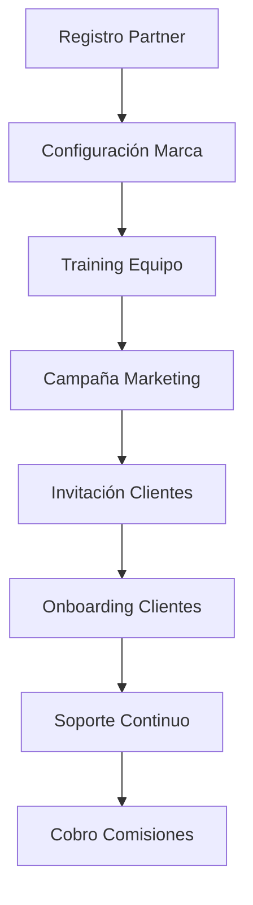
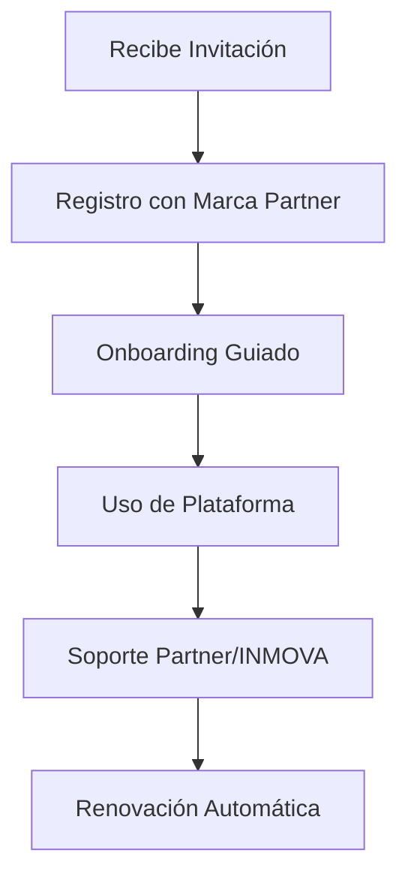

# Modelo de Negocio B2B - Programa de Partners INMOVA

## 📋 Executive Summary

INMOVA lanza su **Programa de Partners B2B**, diseñado para bancos, multifamily offices, plataformas de membresía y otros intermediarios que deseen ofrecer la plataforma a sus clientes con personalización y beneficios económicos recurrentes.

---

## 🎯 Objetivo

Permitir que entidades con acceso a grandes bases de clientes potenciales (estudiantes, suscriptores, clientes bancarios) puedan ofrecer INMOVA como un servicio de valor agregado, generando ingresos recurrentes para ambas partes.

---

## 👥 Perfiles de Partners Objetivo

### 1. **Bancos y Entidades Financieras**
- **Clientes objetivo:** Inversores inmobiliarios, propietarios con hipotecas
- **Valor agregado:** Gestión profesional de sus activos inmobiliarios
- **Beneficio para el banco:** Fidelización, nuevos productos, comisiones
- **Ejemplo:** Banco Santander, BBVA, CaixaBank

### 2. **Multifamily Offices**
- **Clientes objetivo:** Familias con patrimonio inmobiliario diversificado
- **Valor agregado:** Centralización y profesionalización de la gestión
- **Beneficio:** Servicio premium para clientes VIP, comisiones recurrentes
- **Ejemplo:** Abante, Singular Bank

### 3. **Plataformas de Membresía**
- **Clientes objetivo:** Estudiantes, jóvenes profesionales, nómadas digitales
- **Valor agregado:** Acceso a vivienda y gestión simplificada
- **Beneficio:** Nuevos servicios para miembros, ingresos adicionales
- **Ejemplo:** Zona 3, Urban Campus, The Collective

### 4. **Asociaciones de Propietarios**
- **Clientes objetivo:** Pequeños propietarios asociados
- **Valor agregado:** Herramientas profesionales a precio reducido
- **Beneficio:** Servicio diferenciador, comisiones

### 5. **Consultoras Inmobiliarias**
- **Clientes objetivo:** Clientes de asesoría inmobiliaria
- **Valor agregado:** Herramienta de gestión post-venta
- **Beneficio:** Retención de clientes, ingresos recurrentes

---

## 💰 Modelo de Comisiones

### Esquema Base
```
┌─────────────────────────────────────────────────┐
│  Cliente Final (Propietario)                    │
│  Paga: 149€/mes (Plan Profesional)             │
└─────────────────┬───────────────────────────────┘
                  │
                  ├─ 70% → Partner (104.30€/mes)
                  │
                  └─ 30% → INMOVA (44.70€/mes)
└─────────────────────────────────────────────────┘
```

### Escala de Comisiones por Volumen

| Clientes Activos | % Comisión Partner | Ejemplo (149€/mes) |
|------------------|--------------------|-----------|
| 1-10             | 20%                | 29.80€    |
| 11-25            | 30%                | 44.70€    |
| 26-50            | 40%                | 59.60€    |
| 51-100           | 50%                | 74.50€    |
| 101-250          | 60%                | 89.40€    |
| 251+             | 70%                | 104.30€   |

### Ejemplo Real: Banco con 50 clientes
```
Clientes activos: 50
Precio por cliente: 149€/mes
Comisión: 40% = 59.60€/cliente

Ingreso mensual Partner: 50 × 59.60€ = 2,980€/mes
Ingreso anual Partner: 2,980€ × 12 = 35,760€/año
```

---

## 🎁 Beneficios para los Partners

### 1. **Ingresos Recurrentes**
- Comisión mensual por cada cliente activo
- Modelo SaaS: ingresos predecibles y escalables
- Sin necesidad de desarrollo tecnológico propio

### 2. **Personalización de Marca (White Label)**
- Logo y colores corporativos del Partner
- Dominio personalizado (ej: inmobiliaria.bankosantander.com)
- Emails y comunicaciones con imagen del Partner

### 3. **Dashboard Exclusivo para Partners**
- Métricas en tiempo real de clientes
- Tracking de comisiones generadas
- Análisis de uso y engagement
- Reportes mensuales automáticos

### 4. **Soporte y Formación**
- Onboarding dedicado para el Partner
- Formación técnica del equipo del Partner
- Soporte técnico para clientes finales
- Materiales de marketing personalizados

### 5. **Valor Agregado para Clientes**
- Oferta diferenciadora en su cartera de servicios
- Fidelización de clientes existentes
- Captación de nuevos clientes
- Mejor experiencia del cliente

### 6. **Rapidez de Implementación**
- Sin inversión inicial en tecnología
- Plataforma lista para usar en 48 horas
- Sin necesidad de equipo técnico propio

---

## 📊 Caso de Uso: Banco Santander

### Contexto
Banco Santander quiere ofrecer a sus clientes con hipotecas una herramienta profesional de gestión inmobiliaria.

### Implementación
1. **Registro como Partner:**
   - Banco Santander se registra en el portal de Partners
   - Configuración de marca: logo rojo, dominio personalizado

2. **Invitación a Clientes:**
   - El banco invita a 1,000 clientes seleccionados
   - Email personalizado: "Gestiona tu propiedad con Santander"
   - Onboarding simplificado con marca Santander

3. **Activación:**
   - 150 clientes activan la plataforma (tasa conversión 15%)
   - Cada cliente paga 149€/mes
   - Banco recibe 60% de comisión (89.40€/cliente)

### Resultados Primer Año
```
Clientes activos: 150
Comisión mensual: 150 × 89.40€ = 13,410€/mes
Comisión anual: 13,410€ × 12 = 160,920€/año

Beneficios adicionales:
- Mayor fidelización de clientes
- Diferenciación frente a competencia
- Datos valiosos de cartera inmobiliaria
- Cross-selling de otros productos bancarios
```

---

## 🚀 Flujo de Implementación

### Para el Partner



### Para el Cliente Final



---

## 📋 Requisitos Técnicos Implementados

### 1. **Base de Datos**
- Modelo `Partner` (datos del partner, configuración)
- Modelo `PartnerClient` (clientes vinculados)
- Modelo `Commission` (tracking de comisiones)
- Modelo `PartnerInvitation` (invitaciones enviadas)

### 2. **APIs**
- `/api/partners/auth` - Autenticación de Partners
- `/api/partners/dashboard` - Métricas y estadísticas
- `/api/partners/clients` - Gestión de clientes
- `/api/partners/invitations` - Sistema de invitaciones
- `/api/partners/commissions` - Consulta de comisiones

### 3. **Interfaces**
- Portal de registro de Partners
- Dashboard ejecutivo de Partners
- Sistema de invitaciones masivas
- Reportes y analytics
- Configuración de White Label

### 4. **Automatizaciones**
- Cálculo automático de comisiones mensuales
- Facturación automática a clientes finales
- Reportes mensuales a Partners
- Alertas de nuevos clientes
- Sistema de referidos

---

## 📈 Proyecciones de Crecimiento

### Escenario Conservador (Primer Año)
- 10 Partners activos
- Promedio 50 clientes por Partner
- Total: 500 clientes B2B
- Ingreso mensual INMOVA: 500 × 44.70€ = 22,350€/mes
- Ingreso anual INMOVA: 268,200€/año

### Escenario Optimista (Tercer Año)
- 50 Partners activos
- Promedio 100 clientes por Partner
- Total: 5,000 clientes B2B
- Ingreso mensual INMOVA: 5,000 × 44.70€ = 223,500€/mes
- Ingreso anual INMOVA: 2,682,000€/año

---

## 🎯 Estrategia de Go-to-Market

### Fase 1: Lanzamiento Piloto (Mes 1-3)
1. Seleccionar 3 Partners beta (1 banco, 1 multifamily office, 1 plataforma)
2. Implementación y feedback
3. Ajustes del modelo

### Fase 2: Expansión Controlada (Mes 4-6)
1. Abrir registro a 20 Partners
2. Marketing dirigido a bancos y offices
3. Casos de éxito documentados

### Fase 3: Crecimiento Acelerado (Mes 7-12)
1. Apertura general del programa
2. Eventos y webinars para Partners
3. Programa de afiliados de segundo nivel

---

## 📞 Contacto y Recursos

**Email Partners:** partners@inmova.com  
**Teléfono:** +34 900 123 456  
**Portal Partners:** https://inmova.app/partners  
**Documentación:** https://docs.inmova.app/partners  

---

## 📊 KPIs del Programa

| Métrica | Objetivo Año 1 | Objetivo Año 3 |
|---------|----------------|----------------|
| Partners activos | 10 | 50 |
| Clientes B2B | 500 | 5,000 |
| MRR Partners | 22,350€ | 223,500€ |
| ARR Partners | 268,200€ | 2,682,000€ |
| Tasa conversión invitaciones | 10% | 15% |
| Retención clientes B2B | 90% | 95% |

---

**Última actualización:** Diciembre 2025  
**Versión:** 1.0  
**Autor:** Equipo INMOVA - Enxames Investments SL
