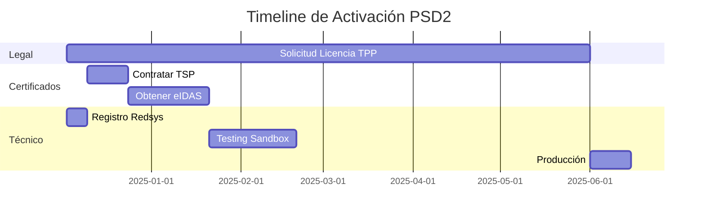

# 🏦 Guía Completa de Activación PSD2 Open Banking en España

## 📌 Resumen Ejecutivo

Esta guía proporciona los pasos completos para activar la integración PSD2 y Open Banking en España para tu plataforma Inmova/Vidaro. El proceso requiere **múltiples autorizaciones legales, certificados cualificados y registros oficiales** que pueden tomar **3-6 meses** y tienen **costes significativos** (€3,000-€10,000 primer año).

---

## ⚠️ ADVERTENCIA IMPORTANTE

**NO PUEDES OPERAR EN PRODUCCIÓN SIN:**
1. ✅ Licencia TPP válida del Banco de España
2. ✅ Certificados eIDAS cualificados (QWAC + QSealC) de un TSP
3. ✅ Registro completado en Redsys PSD2 Platform
4. ✅ Cumplimiento de normativas GDPR y seguridad

Operar sin estos requisitos es **ILEGAL** y puede resultar en sanciones severas.

---

## 🗺️ Roadmap Completo



**Tiempo total estimado:** 6-9 meses  
**Inversión total:** €5,000-€15,000 (primer año)

---

## 📋 PASO 1: Obtener Licencia TPP del Banco de España

### 🎯 Objetivo
Obtener autorización oficial como Third Party Provider (TPP) para operar servicios de Open Banking en España y toda la UE.

### 📊 Características
- **⏱️ Tiempo:** 3-6 meses
- **💰 Coste:** €2,000-€5,000 (asesoría legal + tasas)
- **🔄 Renovación:** Supervisión continua
- **📍 Autoridad:** Banco de España

### 🎓 Tipos de Licencia

| Tipo | Nombre | Servicios | Caso de Uso |
|------|--------|-----------|-------------|
| **AISP** | Account Information Service Provider | Solo lectura de cuentas, saldos y transacciones | Agregadores financieros, gestión PFM |
| **PISP** | Payment Initiation Service Provider | Iniciación de pagos desde cuentas bancarias | Procesamiento de pagos, e-commerce |
| **Ambos** | AISP + PISP | Lectura + Iniciación de pagos | Plataformas completas (tu caso) |

**✅ Para Inmova/Vidaro necesitas: AMBOS (AISP + PISP)**

### 📝 Proceso de Solicitud

#### 1.1 Preparación (2-4 semanas)

**Documentación requerida:**
- ✅ Modelo de negocio detallado
- ✅ Estructura corporativa y organigrama
- ✅ Plan financiero (3 años)
- ✅ Medidas de seguridad y protección de datos
- ✅ Políticas de cumplimiento y prevención de fraude
- ✅ Plan de continuidad de negocio
- ✅ Documentación legal de la empresa (escrituras, estatutos)
- ✅ Capital social mínimo (varía según servicios)
- ✅ Seguro de responsabilidad civil profesional

**Consultar guía oficial:**
- 📄 [Guía informativa para solicitantes - Banco de España](https://www.bde.es/)
- 📧 Departamento de Supervisión: supervision@bde.es

#### 1.2 Reunión Previa (Recomendada)

1. **Solicitar reunión previa** con el Banco de España
2. Usar el **formulario de pre-solicitud de autorización**
3. **Objetivo:** Clarificar actividades exactas antes de la solicitud formal
4. **Beneficio:** Evitar rechazos por errores en la documentación

#### 1.3 Presentación de Solicitud

**Canales disponibles:**

1. **Electrónicamente** (recomendado):
   - A través del Registro Electrónico del Banco de España
   - Requiere certificado digital
   - Más rápido y trazable

2. **Presencialmente:**
   - En oficinas del Banco de España
   - Calle Alcalá, 48, Madrid
   - Requiere cita previa

3. **Por correo postal:**
   - Dirección: Banco de España, Calle Alcalá 48, 28014 Madrid
   - Requiere acuse de recibo

#### 1.4 Evaluación y Aprobación (3-6 meses)

- **Revisión de documentación** por el Banco de España
- **Entrevistas** con la dirección de la empresa
- **Inspección** de medidas de seguridad y cumplimiento
- **Verificación** de solvencia financiera
- **Emisión de licencia** (si se aprueba)

#### 1.5 Supervisión Continua

Una vez autorizado:
- ✅ Supervisión permanente por el Banco de España
- ✅ Reportes periódicos obligatorios
- ✅ Auditorías de cumplimiento
- ✅ Renovación de certificaciones

### 🌍 Passporting (Operación en UE)

Con licencia del Banco de España puedes operar en **todos los países de la UE** mediante "passporting":
- Notificar al Banco de España tu intención
- Comunicar al regulador del país destino
- No requiere nueva licencia completa

### 🔗 Recursos Oficiales

- 🌐 [Banco de España - Entidades de Pago](https://www.bde.es/wbe/es/entidades-supervision/entidades-credito-pago/)
- 📧 Email: serviciosdepago@bde.es
- 📞 Teléfono: +34 91 338 5000

---

## 🔐 PASO 2: Obtener Certificados eIDAS Cualificados

### 🎯 Objetivo
Obtener certificados digitales cualificados que permiten:
1. **Autenticación segura** ante bancos (QWAC)
2. **Firma digital** de transacciones (QSealC)

### 📊 Características
- **⏱️ Tiempo:** 2-4 semanas
- **💰 Coste:** €1,000-€3,000/año
- **🔄 Renovación:** Anual
- **📍 Emisor:** Trust Service Provider (TSP) cualificado

### 🎓 Tipos de Certificados Necesarios

#### QWAC (Qualified Website Authentication Certificate)
- **Propósito:** Autenticación a nivel de transporte (SSL/TLS)
- **Uso:** Identificar tu TPP ante los bancos
- **Equivalente:** Certificado SSL mejorado con datos PSD2
- **Estándar:** ETSI TS 119 495

#### QSealC (Qualified Electronic Seal Certificate)
- **Propósito:** Firma a nivel de aplicación
- **Uso:** Garantizar integridad y origen de datos
- **Equivalente:** Firma digital corporativa
- **Estándar:** ETSI TS 119 495

**⚠️ AMBOS certificados son OBLIGATORIOS para producción**

### 🏢 Proveedores TSP en España

#### Comparativa de Proveedores

| Proveedor | Tipo | Coste Anual | Características | Recomendado Para |
|-----------|------|-------------|-----------------|------------------|
| **Camerfirma** | Privado | €1,500-€2,500 | Asociado con Cámaras de Comercio, soporte excelente | Empresas medianas/grandes |
| **FNMT-RCM** | Público | €800-€1,500 | Proveedor oficial del gobierno español | Administraciones públicas |
| **Firmaprofesional** | Privado | €1,000-€2,000 | Especializado en soluciones empresariales | Empresas de todos los tamaños |
| **Izenpe** | Público | €900-€1,800 | Proveedor del País Vasco | Empresas en País Vasco |
| **ANF AC** | Privado | €1,200-€2,200 | Amplia experiencia en certificados empresariales | Pymes y grandes empresas |
| **EADTrust** | Privado | Gratuito (test) | Certificados de prueba para desarrollo | Solo testing/sandbox |

#### 1. Camerfirma ⭐ (Recomendado)
**Por qué elegirlo:**
- ✅ Mayor experiencia en certificados PSD2 en España
- ✅ Soporte dedicado para integraciones bancarias
- ✅ Partnership con Infocert (red europea)
- ✅ Proceso ágil (2-3 semanas)
- ✅ Renovación automática disponible

**Contacto:**
- 🌐 https://www.camerfirma.com
- 📧 psd2@camerfirma.com
- 📞 +34 902 362 377

**Proceso:**
1. Contactar departamento PSD2
2. Solicitar paquete "Certificados eIDAS PSD2"
3. Proporcionar documentación empresarial + licencia TPP
4. Verificación de identidad (presencial o videollamada)
5. Emisión en 2-3 semanas

#### 2. FNMT-RCM (Fábrica Nacional de Moneda y Timbre)
**Por qué elegirlo:**
- ✅ Proveedor oficial del Estado español
- ✅ Mayor confianza institucional
- ✅ Coste más económico
- ❌ Proceso más lento (3-4 semanas)
- ❌ Menos soporte especializado en PSD2

**Contacto:**
- 🌐 https://www.sede.fnmt.gob.es
- 📧 consultaceres@fnmt.es
- 📞 +34 915 668 930

#### 3. Firmaprofesional
**Por qué elegirlo:**
- ✅ Especializado en soluciones empresariales
- ✅ Plataforma de gestión de certificados incluida
- ✅ Buen balance precio/calidad
- ✅ Soporte técnico 24/7

**Contacto:**
- 🌐 https://www.firmaprofesional.com
- 📧 atencioncliente@firmaprofesional.com
- 📞 +34 910 059 621

#### 4. EADTrust (Solo para Testing)
**Para qué usarlo:**
- ✅ Certificados de prueba GRATUITOS
- ✅ Válidos en entornos sandbox
- ❌ NO válidos en producción

**Uso:**
Perfecto para desarrollo inicial mientras tramitas los certificados oficiales.

**Contacto:**
- 🌐 https://www.eadtrust.eu
- 📧 info@eadtrust.eu

### 📝 Proceso de Obtención

#### Paso 2.1: Seleccionar Proveedor TSP
**Recomendación para Vidaro:** Camerfirma

**Criterios de decisión:**
- Experiencia con PSD2
- Calidad de soporte técnico
- Tiempo de emisión
- Coste
- Facilidad de renovación

#### Paso 2.2: Preparar Documentación

**Documentos necesarios:**
- ✅ NIF de la empresa (CIF)
- ✅ Escritura de constitución
- ✅ Estatutos sociales
- ✅ Licencia TPP del Banco de España ⚠️ (requisito previo)
- ✅ Poder notarial del representante legal
- ✅ DNI/NIE del representante legal
- ✅ Comprobante de domicilio social

#### Paso 2.3: Solicitud

**Pasos:**
1. Contactar con el TSP elegido
2. Completar formulario de solicitud online
3. Subir documentación escaneada
4. Pagar las tasas correspondientes
5. Agendar verificación de identidad

#### Paso 2.4: Verificación de Identidad

**Opciones:**
- **Presencial:** Visita a oficina del TSP
- **Videollamada:** Con agente verificador (más común)
- **Agente verificador:** El TSP envía un agente a tu oficina

**Requiere:**
- DNI/NIE original del representante legal
- Presencia física del representante
- 15-30 minutos de duración

#### Paso 2.5: Emisión de Certificados

**Timeline:**
- Verificación completada → 3-5 días hábiles
- Emisión de certificados en formato .pem
- Recepción por correo electrónico seguro
- Contraseña de protección enviada por SMS

**Recibirás:**
```
qwac_certificate.pem          # Certificado QWAC (público)
qwac_private_key.pem          # Clave privada QWAC (secreto)
qwac_chain.pem                # Cadena de certificación

qseal_certificate.pem         # Certificado QSealC (público)
qseal_private_key.pem         # Clave privada QSealC (secreto)
qseal_chain.pem               # Cadena de certificación
```

#### Paso 2.6: Instalación en Infraestructura

**Ubicación recomendada:**
```bash
/opt/inmova/certificates/production/
├── qwac_certificate.pem
├── qwac_private_key.pem
├── qwac_chain.pem
├── qseal_certificate.pem
├── qseal_private_key.pem
└── qseal_chain.pem
```

**Permisos:**
```bash
chmod 400 *_private_key.pem  # Solo lectura para owner
chmod 444 *_certificate.pem  # Lectura para todos
chown inmova:inmova *.pem    # Owner: usuario de la app
```

**Variables de entorno:**
```bash
REDSYS_QWAC_CERTIFICATE_PATH=/opt/inmova/certificates/production/qwac_certificate.pem
REDSYS_QWAC_KEY_PATH=/opt/inmova/certificates/production/qwac_private_key.pem
REDSYS_QSEAL_CERTIFICATE_PATH=/opt/inmova/certificates/production/qseal_certificate.pem
REDSYS_QSEAL_KEY_PATH=/opt/inmova/certificates/production/qseal_private_key.pem
```

### 🔄 Renovación Anual

**Proceso:**
- El TSP notifica 30-60 días antes del vencimiento
- Renovación simplificada (no requiere toda la documentación)
- Pago de tasas de renovación (generalmente 50-70% del coste inicial)
- Emisión de nuevos certificados
- Actualización en infraestructura

**⚠️ CRÍTICO:** No dejar que los certificados expiren, interrumpiría el servicio.

---

## 🔌 PASO 3: Registro en Redsys PSD2 Platform

### 🎯 Objetivo
Registrarse como desarrollador TPP en la plataforma Redsys PSD2, que actúa como **hub de conectividad** para múltiples bancos españoles.

### 📊 Características
- **⏱️ Tiempo:** 1-2 semanas
- **💰 Coste:** Gratuito (plataforma), costes por transacción en producción
- **🏦 Bancos conectados:** Bankinter, BBVA, Santander, CaixaBank, Sabadell, Kutxabank, y más

### 🌐 ¿Qué es Redsys PSD2 Platform?

Redsys PSD2 Platform es un **hub de conectividad** que:
- ✅ Centraliza APIs de múltiples bancos españoles
- ✅ Estandariza el formato de comunicación
- ✅ Simplifica la integración (una API para muchos bancos)
- ✅ Proporciona entorno sandbox para testing
- ✅ Ofrece soporte técnico especializado

**Alternativa:** Conectarse directamente con cada banco (más complejo, requiere integración individual).

### 📝 Proceso de Registro

#### 3.1 Crear Cuenta de Desarrollador

**Portal:** https://market.apis-i.redsys.es/psd2/xs2a

**Credenciales a usar:**
- 📧 Email: `dvillagra@vidaroinversiones.com`
- 🔑 Password: `Pucela00` (cambiar después del primer login)

**Pasos:**
1. Ir a: https://market.apis-i.redsys.es/psd2/xs2a
2. Click en "Registrarse" / "Sign Up"
3. Completar formulario:
   - Email: dvillagra@vidaroinversiones.com
   - Nombre: Daniel Villagra
   - Empresa: Vidaro Inversiones
   - País: España
   - Tipo: TPP Developer
4. Verificar email (link de activación)
5. Completar perfil de empresa

#### 3.2 Registrar Aplicación

**Después de login:**
1. Ir a "Mis Aplicaciones" / "My Applications"
2. Click en "Nueva Aplicación" / "New Application"
3. Completar datos:
   - **Nombre:** "Inmova Platform PSD2"
   - **Descripción:** "Plataforma de gestión inmobiliaria con servicios Open Banking"
   - **Callback URLs:**
     - Sandbox: `https://homming-vidaro-6q1wdi.abacusai.app/api/open-banking/callback`
     - Producción: `https://inmova.app/api/open-banking/callback`
   - **Tipo de servicios:** AISP + PISP
   - **Número de autorización TPP:** (tu número del Banco de España)

**Resultado:**
- ✅ `Application ID` (client_id) generado
- ✅ `Application Secret` (client_secret) generado

**⚠️ GUARDAR ESTOS DATOS INMEDIATAMENTE** (no se pueden recuperar después)

#### 3.3 Suscribirse a Plan de API

**Planes disponibles:**

| Plan | Entorno | Coste | Límites | Uso |
|------|---------|-------|---------|-----|
| **Sandbox Free** | Sandbox | Gratis | Ilimitado | Desarrollo y testing |
| **Production Basic** | Producción | Por transacción | Según volumen | Producción real |

**Suscripción:**
1. Ir a "Planes" / "Plans"
2. Seleccionar "Sandbox Free" (para empezar)
3. Click en "Suscribir"
4. Confirmar por email
5. Estado: "Activo"

#### 3.4 Configurar Autenticación OAuth2

**Pestaña "OAuth2" en el portal:**

**Para Sandbox:**
```bash
# Credenciales de prueba públicas de Redsys
USERNAME: user1
PASSWORD: 1234
CLIENT_ID: [tu application ID]
CLIENT_SECRET: [tu application secret]
```

**Para Producción:**
- Usar tus propias credenciales empresariales
- Configuradas en el perfil de tu aplicación

**Generar Token de Prueba:**
1. Ir a pestaña "OAuth2"
2. Seleccionar "Generate Token"
3. Usar credenciales sandbox (user1/1234)
4. Copiar `access_token` generado
5. Token válido por 30 minutos

#### 3.5 Configurar Certificados TPP

**Header obligatorio:** `TPP-Signature-Certificate`

**Para Sandbox/Testing:**
- Redsys proporciona un **certificado genérico** temporal
- Descargable desde el portal
- Válido solo en sandbox
- No requiere certificados eIDAS reales

**Para Producción:**
- DEBES usar tus **certificados eIDAS reales** (del Paso 2)
- Subir certificado QSealC al portal de Redsys
- ⚠️ **CRÍTICO:** El `organizationId` del certificado debe coincidir con el `client_id`

**Subir certificados en producción:**
1. Ir a "Certificados" / "Certificates"
2. Click en "Subir Certificado QSealC"
3. Seleccionar archivo `qseal_certificate.pem`
4. Verificación automática por Redsys
5. Estado: "Validado" ✅

### 🔧 Configuración Técnica

#### URLs de API

**Sandbox (Desarrollo):**
```bash
# API Principal
https://apis-i.redsys.es:20443/psd2/xs2a/api-entrada-xs2a/services

# OAuth
https://apis-i.redsys.es:20443/psd2/xs2a/api-oauth-xs2a
```

**Producción:**
```bash
# API Principal
https://psd2.redsys.es/api-entrada-xs2a/services

# OAuth
https://psd2.redsys.es/api-oauth-xs2a
```

#### APIs Disponibles

**1. Account Information Service (AIS):**
- `GET /accounts` - Listar cuentas del usuario
- `GET /accounts/{accountId}` - Detalles de cuenta
- `GET /accounts/{accountId}/balances` - Saldos
- `GET /accounts/{accountId}/transactions` - Historial de transacciones
- `POST /consents` - Solicitar consentimiento de acceso

**2. Payment Initiation Service (PIS):**
- `POST /payments/sepa-credit-transfers` - Pago único
- `POST /payments/cross-border-credit-transfers` - Pago internacional
- `POST /bulk-payments` - Pagos múltiples
- `POST /periodic-payments` - Pagos recurrentes
- `GET /payments/{paymentId}/status` - Estado de pago

**3. Confirmation of Funds Service (FCS):**
- `POST /funds-confirmations` - Confirmar disponibilidad de fondos

**4. OAuth2:**
- `POST /token` - Obtener access token
- `POST /authorize` - Solicitar autorización

### 📞 Soporte Técnico Redsys

**Canales de soporte:**

1. **Email Sandbox:**
   - 📧 psd2.sandbox.soporte@redsys.es
   - Respuesta: 24-48h
   - Horario: L-V 9:00-18:00 CET

2. **Email Producción:**
   - 📧 psd2.hub.soporte@redsys.es
   - Respuesta: 12-24h
   - Soporte prioritario

3. **Sistema de Tickets Web:**
   - Acceso desde el portal de desarrolladores
   - Tracking de incidencias
   - Historial de consultas

**Para registrarte en la herramienta de tickets:**
- Enviar email con:
  - Certificado de conexión
  - Nombre y apellidos
  - DNI/CIF
  - Nombre de empresa
  - Email de contacto

### 📚 Documentación Técnica

**Recursos disponibles:**
- 📄 [Guía Técnica TPP v1.8.5](https://hub-i.redsys.es:16443/psd2-doc/DOC_TPP_v.1.8.5_evo_vCastellano.pdf)
- 📄 [API Reference - Bankinter](https://market.apis-i.redsys.es/psd2/xs2a/nodos/bankinter)
- 📄 [Ejemplos de integración](https://market.apis-i.redsys.es/psd2/xs2a/ejemplos)
- 🛠️ [SDKs disponibles](https://market.apis-i.redsys.es/psd2/xs2a/sdks): Java, Node.js, Python, PHP

---

## 🏦 PASO 4: Configuración Específica por Banco

### Bancos Disponibles a través de Redsys

Redsys PSD2 Platform conecta con los principales bancos españoles mediante códigos de entidad:

#### 4.1 Bankinter
**Código Redsys:** `bankinter`

**Características:**
- ✅ APIs estables y bien documentadas
- ✅ Soporte completo AIS + PIS + FCS
- ✅ Flujo SCA por redirección
- ✅ Testing en sandbox sin cuenta real

**Endpoints específicos:**
```bash
# Todos los endpoints usan el parámetro:
?aspsp=bankinter

# Ejemplo: Listar cuentas de Bankinter
GET /accounts?aspsp=bankinter
```

**Documentación:**
- https://market.apis-i.redsys.es/psd2/xs2a/nodos/bankinter

#### 4.2 BBVA
**Código Redsys:** `bbva`

**Características:**
- ✅ Pionero en Open Banking en España
- ✅ API propia además de Redsys
- ✅ BBVA API Market: https://www.bbva.com/es/api-market/
- ⚠️ Puede requerir registro adicional en BBVA

**Opciones de integración:**
1. **A través de Redsys** (más simple, estandarizado)
2. **Directamente con BBVA API Market** (más control, más complejo)

**Recomendación:** Empezar con Redsys

#### 4.3 Santander
**Código Redsys:** `santander`

**Características:**
- ✅ Soporte completo PSD2
- ✅ Developer Hub propio: https://developerhub.santander.com/
- ⚠️ Algunas APIs solo disponibles directamente

#### 4.4 CaixaBank
**Código Redsys:** `caixabank`

**Características:**
- ✅ Integración completa en Redsys
- ✅ Buen soporte AIS
- ⚠️ PIS puede tener limitaciones

#### 4.5 Sabadell
**Código Redsys:** `sabadell`

#### 4.6 Kutxabank
**Código Redsys:** `kutxabank`

#### 4.7 Otros Bancos

**Lista completa disponible en:**
https://market.apis-i.redsys.es/psd2/xs2a/nodos

### Configuración Multi-Banco

**Ventaja de Redsys:** Una sola integración técnica funciona para todos los bancos.

**Diferencias por banco:**
- Códigos de entidad (`aspsp` parameter)
- Flujos de SCA (algunos redirigen, otros usan app móvil)
- Timeouts de consentimiento
- Formatos de respuesta pueden variar ligeramente

**Estrategia recomendada:**
1. **Fase 1:** Implementar Bankinter completo (más estable)
2. **Fase 2:** Añadir BBVA y Santander
3. **Fase 3:** Resto de bancos bajo demanda de usuarios

---

## 🧪 PASO 5: Testing en Sandbox

### 🎯 Objetivo
Validar la integración completa antes de pasar a producción.

### 📋 Checklist de Testing

#### 5.1 Testing de Autenticación
- [ ] Obtener token OAuth2 con credenciales sandbox
- [ ] Verificar expiración y renovación de tokens
- [ ] Validar headers obligatorios (TPP-Signature-Certificate)
- [ ] Comprobar respuestas de error de autenticación

#### 5.2 Testing de AIS (Account Information)
- [ ] Crear consentimiento de lectura
- [ ] Flujo completo de autorización con SCA
- [ ] Listar cuentas del usuario
- [ ] Obtener saldos de cuenta
- [ ] Consultar transacciones (últimos 90 días)
- [ ] Renovar consentimiento antes de expiración
- [ ] Revocar consentimiento

#### 5.3 Testing de PIS (Payment Initiation)
- [ ] Crear consentimiento de pago
- [ ] Flujo SCA para autorizar pago
- [ ] Iniciar pago SEPA único
- [ ] Verificar estado de pago
- [ ] Probar pago rechazado (fondos insuficientes)
- [ ] Probar pago recurrente
- [ ] Probar pago múltiple (bulk)

#### 5.4 Testing de Errores
- [ ] Token expirado
- [ ] Consentimiento denegado por usuario
- [ ] Cuenta no encontrada
- [ ] Fondos insuficientes
- [ ] Límites de transacción excedidos
- [ ] Timeout de API
- [ ] Certificado inválido

#### 5.5 Testing de UX
- [ ] Flujo de redirección SCA mobile-friendly
- [ ] Timeouts en flujo de autorización
- [ ] Mensajes de error claros para usuario
- [ ] Loading states durante llamadas API
- [ ] Manejo de sesión expirada

### 🛠️ Herramientas de Testing

**1. Postman Collection**
- Descargar colección de Redsys
- Importar en Postman
- Configurar variables de entorno
- Ejecutar tests secuenciales

**2. Usuarios de Prueba en Sandbox**
```bash
# Redsys proporciona usuarios ficticios:
User: user1
Password: 1234

# Con cuentas bancarias simuladas:
IBAN: ES7921000000000000000000
Saldo: €10,000
```

**3. Logs y Monitorización**
- Activar modo debug en variables de entorno
- Capturar todos los requests/responses
- Analizar tiempos de respuesta
- Identificar cuellos de botella

### ⏱️ Métricas de Testing

**Objetivos de rendimiento:**
- Autenticación OAuth: < 500ms
- Listar cuentas: < 2s
- Obtener transacciones: < 3s
- Iniciar pago: < 2s
- Flujo SCA completo: < 30s

**Disponibilidad esperada:**
- APIs Redsys: 99.9% uptime
- Sandbox: 99% uptime (puede tener mantenimientos)

---

## 🚀 PASO 6: Paso a Producción

### 🎯 Objetivo
Activar el servicio en entorno real con usuarios y transacciones reales.

### ✅ Pre-requisitos para Producción

**CRÍTICOS (sin estos NO puedes pasar a producción):**
- [ ] ✅ Licencia TPP válida del Banco de España
- [ ] ✅ Certificados eIDAS de producción instalados
- [ ] ✅ Aplicación registrada en Redsys con certificados reales
- [ ] ✅ Testing completo en sandbox sin errores críticos
- [ ] ✅ Cumplimiento GDPR (políticas de privacidad actualizadas)
- [ ] ✅ Términos y condiciones actualizados con servicios PSD2
- [ ] ✅ Seguro de responsabilidad civil activo
- [ ] ✅ Sistema de monitorización configurado
- [ ] ✅ Plan de respuesta a incidentes

### 📝 Proceso de Activación

#### 6.1 Solicitar Paso a Producción

**Contactar con Redsys:**
1. Email a: psd2.hub.soporte@redsys.es
2. Asunto: "Solicitud de paso a producción - [Nombre empresa]"
3. Incluir:
   - Application ID
   - Certificados eIDAS subidos
   - Número de licencia TPP
   - Bancos con los que se va a operar
   - Fecha estimada de go-live

**Revisión por Redsys:**
- Validación de certificados
- Verificación de licencia TPP
- Aprobación de aplicación
- Activación de APIs de producción
- Tiempo: 3-5 días hábiles

#### 6.2 Actualizar Variables de Entorno

```bash
# Cambiar URLs de sandbox a producción
REDSYS_API_URL=https://psd2.redsys.es/api-entrada-xs2a/services
REDSYS_OAUTH_URL=https://psd2.redsys.es/api-oauth-xs2a
REDSYS_ENVIRONMENT=production

# Usar certificados de producción
REDSYS_QWAC_CERTIFICATE_PATH=/opt/inmova/certificates/production/qwac_certificate.pem
REDSYS_QWAC_KEY_PATH=/opt/inmova/certificates/production/qwac_private_key.pem
REDSYS_QSEAL_CERTIFICATE_PATH=/opt/inmova/certificates/production/qseal_certificate.pem
REDSYS_QSEAL_KEY_PATH=/opt/inmova/certificates/production/qseal_private_key.pem

# Credenciales de producción
REDSYS_CLIENT_ID=[tu client_id de producción]
REDSYS_CLIENT_SECRET=[tu client_secret de producción]

# Desactivar modo debug
OPEN_BANKING_DEBUG=false
```

#### 6.3 Testing en Producción

**⚠️ IMPORTANTE:** Usar cuentas bancarias reales de prueba internas antes de abrir a usuarios.

**Protocolo de testing:**
1. Cuenta bancaria del equipo técnico
2. Flujo completo AIS (lectura)
3. Flujo completo PIS (pago de €0.01)
4. Verificar que el pago real se ejecuta
5. Validar notificaciones y logs
6. Comprobar en extracto bancario

**Duración:** 2-3 días con monitorización intensiva

#### 6.4 Go-Live Progresivo

**Estrategia recomendada:**

**Fase 1: Beta cerrada (1-2 semanas)**
- 10-20 usuarios beta seleccionados
- Monitorización 24/7
- Feedback directo
- Ajustes rápidos

**Fase 2: Beta abierta (2-4 semanas)**
- Invitaciones por email a usuarios activos
- Soporte dedicado
- Análisis de métricas

**Fase 3: Lanzamiento general**
- Anuncio público
- Marketing activo
- Soporte escalado

### 📊 Monitorización en Producción

**KPIs críticos:**
- ✅ Tasa de éxito de autenticación OAuth
- ✅ Tasa de éxito de consentimientos
- ✅ Tasa de éxito de pagos
- ✅ Tiempo de respuesta de APIs
- ✅ Errores HTTP 4xx/5xx
- ✅ Disponibilidad del servicio

**Alertas configurar:**
- 🚨 Tasa de error > 5%
- 🚨 Tiempo de respuesta > 5s
- 🚨 Disponibilidad < 99%
- 🚨 Certificado próximo a expirar (< 30 días)
- 🚨 Token OAuth expirado sin renovación

**Herramientas:**
- Sentry (errores de aplicación)
- DataDog / New Relic (métricas de rendimiento)
- PagerDuty (alertas críticas)
- Logs centralizados (ELK Stack)

---

## 💰 Resumen de Costes

### Inversión Inicial (Primer Año)

| Concepto | Coste | Tiempo |
|----------|-------|--------|
| **Asesoría legal TPP** | €2,000-€5,000 | 3-6 meses |
| **Tasas Banco de España** | €500-€1,000 | - |
| **Certificados eIDAS** | €1,500-€3,000 | 2-4 semanas |
| **Seguro RC profesional** | €800-€1,500 | - |
| **Desarrollo e integración** | €3,000-€8,000 | 2-3 meses |
| **Testing y QA** | €1,000-€2,000 | 1 mes |
| **Monitorización (anual)** | €500-€1,000 | - |
| **TOTAL AÑO 1** | **€9,300-€21,500** | **6-9 meses** |

### Costes Recurrentes (Años siguientes)

| Concepto | Coste Anual |
|----------|-------------|
| **Renovación certificados eIDAS** | €1,000-€2,000 |
| **Seguro RC profesional** | €800-€1,500 |
| **Supervisión Banco de España** | €500-€1,000 |
| **Comisiones Redsys** | Variable por transacción |
| **Mantenimiento y soporte** | €2,000-€5,000 |
| **Monitorización** | €500-€1,000 |
| **TOTAL ANUAL** | **€5,800-€11,500** |

### Costes por Transacción (Producción)

**Modelo de Redsys:**
- Lectura de cuentas (AIS): Gratis o tarifa plana mensual
- Iniciación de pagos (PIS): €0.10-€0.50 por transacción
- Volumen alto: Descuentos por volumen

**Estrategia de monetización:**
- Absorber costes en planes premium
- Cobrar comisión adicional por uso de Open Banking
- Ofrecer gratis como diferenciador competitivo

---

## 📅 Timeline Detallado

### Mes 1-3: Fase Legal
- **Semana 1-2:** Preparar documentación TPP
- **Semana 3-4:** Reunión previa Banco de España
- **Semana 5-8:** Presentar solicitud formal TPP
- **Semana 9-12:** Evaluación por Banco de España

### Mes 2-3: Certificados (en paralelo)
- **Semana 5-6:** Seleccionar y contactar TSP
- **Semana 7-8:** Proporcionar documentación y verificación
- **Semana 9-10:** Emisión de certificados eIDAS
- **Semana 11:** Instalación en infraestructura

### Mes 3-4: Integración Técnica
- **Semana 9-10:** Registro en Redsys, configurar sandbox
- **Semana 11-14:** Desarrollo de integración
- **Semana 15-16:** Testing exhaustivo en sandbox

### Mes 5-6: Producción
- **Semana 17-18:** Solicitar paso a producción
- **Semana 19:** Testing en producción
- **Semana 20-22:** Beta cerrada
- **Semana 23-24:** Lanzamiento general

**Total: 6 meses (optimista) a 9 meses (realista)**

---

## 🔒 Cumplimiento y Seguridad

### GDPR y Protección de Datos

**Obligaciones:**
- ✅ Actualizar política de privacidad con tratamiento de datos bancarios
- ✅ Base legal: Consentimiento explícito + ejecución de contrato
- ✅ DPO (Data Protection Officer) si procesa datos a gran escala
- ✅ DPIA (Data Protection Impact Assessment) recomendada
- ✅ Registro de actividades de tratamiento actualizado
- ✅ Medidas de seguridad técnicas y organizativas

**Derechos de usuarios:**
- Información clara sobre qué datos se acceden
- Revocación de consentimientos en cualquier momento
- Portabilidad de datos
- Supresión de datos al revocar consentimiento

### Strong Customer Authentication (SCA)

**Requisito PSD2:** Autenticación con al menos 2 de 3 elementos:
1. **Conocimiento:** Algo que el usuario sabe (password, PIN)
2. **Posesión:** Algo que el usuario tiene (móvil, token)
3. **Inherencia:** Algo que el usuario es (huella, facial)

**Implementación:**
- Redsys maneja SCA con redirección al banco
- El banco es responsable de la autenticación
- Tu plataforma recibe confirmación de SCA exitosa

**Excepciones a SCA:**
- Transacciones < €30 (con límites de frecuencia)
- Transacciones de bajo riesgo (TRA)
- Beneficiarios de confianza
- Merchant Initiated Transactions (MIT)
- Pagos recurrentes (solo primero requiere SCA)

### Seguridad de Certificados

**Mejores prácticas:**
- 🔒 Almacenar claves privadas cifradas
- 🔒 Usar HSM (Hardware Security Module) si es posible
- 🔒 Restringir acceso a claves privadas (chmod 400)
- 🔒 Rotar certificados antes de expiración
- 🔒 Backup seguro de certificados
- 🔒 Logs de acceso a certificados
- 🔒 Alertas de uso inusual

### Gestión de Consentimientos

**Ciclo de vida:**
1. **Solicitud:** Usuario autoriza acceso específico
2. **Validez:** Máximo 90 días para AIS, único uso para PIS
3. **Renovación:** Solicitar nuevo consentimiento antes de expiración
4. **Revocación:** Usuario puede revocar en cualquier momento
5. **Caducidad:** Eliminar datos al expirar consentimiento

**Registro obligatorio:**
- Fecha y hora de consentimiento
- Alcance del consentimiento (cuentas, datos accedidos)
- Fecha de expiración
- Fecha de revocación (si aplica)
- IP del usuario al consentir

---

## 🚨 Incidencias y Troubleshooting

### Problemas Comunes y Soluciones

#### Error: "Invalid TPP Certificate"
**Causa:** Certificado no válido o no reconocido
**Solución:**
1. Verificar que el certificado es eIDAS cualificado
2. Comprobar que no está expirado
3. Validar que `organizationId` coincide con `client_id`
4. Revisar que está subido correctamente en Redsys
5. Contactar soporte de Redsys para validación manual

#### Error: "Consent Expired"
**Causa:** Consentimiento AIS ha expirado (>90 días)
**Solución:**
1. Implementar renovación automática antes de expiración
2. Notificar al usuario para renovar
3. Solicitar nuevo consentimiento
4. Guardar fecha de expiración al obtener consentimiento

#### Error: "SCA Method Failed"
**Causa:** Usuario no completó autenticación en el banco
**Solución:**
1. Implementar timeout de 5 minutos en flujo SCA
2. Mostrar instrucciones claras de qué hacer en el banco
3. Permitir reintentar el flujo
4. Logs detallados para diagnosticar abandono

#### Error: "Bank API Timeout"
**Causa:** Banco no responde en tiempo razonable
**Solución:**
1. Aumentar timeout a 30 segundos
2. Implementar reintentos automáticos (máx 3)
3. Mostrar mensaje amigable al usuario
4. Logs para reportar a Redsys si es recurrente

#### Error: "Insufficient Funds"
**Causa:** Usuario no tiene saldo suficiente para el pago
**Solución:**
1. Consultar saldo antes de iniciar pago (si tienes consentimiento AIS)
2. Mostrar mensaje claro al usuario
3. Sugerir métodos de pago alternativos

### Contactos de Soporte

**Redsys PSD2:**
- 📧 Sandbox: psd2.sandbox.soporte@redsys.es
- 📧 Producción: psd2.hub.soporte@redsys.es
- 🌐 Portal: https://market.apis-i.redsys.es/psd2/xs2a/help

**Banco de España:**
- 📧 serviciosdepago@bde.es
- 📞 +34 91 338 5000
- 🌐 https://www.bde.es/

**Tu TSP (ejemplo Camerfirma):**
- 📧 psd2@camerfirma.com
- 📞 +34 902 362 377

---

## ✅ Checklist Final de Activación

### Pre-Producción
- [ ] Licencia TPP aprobada por Banco de España
- [ ] Certificados eIDAS de producción instalados
- [ ] Aplicación registrada en Redsys (producción)
- [ ] Certificados subidos y validados en Redsys
- [ ] Variables de entorno configuradas (producción)
- [ ] Testing sandbox completo sin errores críticos
- [ ] Testing en producción con cuenta interna exitoso
- [ ] Política de privacidad actualizada
- [ ] Términos y condiciones actualizados
- [ ] Seguro RC activo y vigente
- [ ] Monitorización configurada
- [ ] Alertas configuradas
- [ ] Plan de respuesta a incidentes documentado
- [ ] Equipo de soporte capacitado

### Post-Producción
- [ ] Beta cerrada exitosa (1-2 semanas)
- [ ] Métricas de rendimiento dentro de objetivos
- [ ] Feedback de usuarios beta positivo
- [ ] Ajustes realizados según feedback
- [ ] Beta abierta exitosa (2-4 semanas)
- [ ] Escalado de infraestructura validado
- [ ] Documentación de usuario disponible
- [ ] FAQs y soporte preparado

### Lanzamiento General
- [ ] Anuncio público preparado
- [ ] Material de marketing listo
- [ ] Equipo de soporte escalado
- [ ] Monitorización 24/7 activa
- [ ] Backups y recuperación testeados
- [ ] Compliance GDPR auditado

---

## 📞 Próximos Pasos Inmediatos

### Acciones para Esta Semana

1. **Solicitar reunión previa con Banco de España**
   - Preparar presentación de modelo de negocio
   - Documentar servicios AISP + PISP requeridos
   - Agendar reunión por email

2. **Contactar con Camerfirma (TSP recomendado)**
   - Email a: psd2@camerfirma.com
   - Solicitar información sobre certificados eIDAS para PSD2
   - Preguntar por timeline y costes

3. **Completar registro en Redsys Portal**
   - Usar credenciales: dvillagra@vidaroinversiones.com / Pucela00
   - Registrar aplicación "Inmova Platform PSD2"
   - Obtener client_id y client_secret

4. **Revisar documentación técnica**
   - Estudiar [Guía TPP de Redsys](https://hub-i.redsys.es:16443/psd2-doc/DOC_TPP_v.1.8.5_evo_vCastellano.pdf)
   - Familiarizarse con flujos OAuth y SCA

5. **Preparar presupuesto interno**
   - Presentar costes estimados (€9k-€21k primer año)
   - Obtener aprobación de inversión
   - Definir timeline de 6-9 meses

---

## 📚 Recursos Adicionales

### Documentación Oficial
- 📄 [Directiva PSD2 (UE) 2015/2366](https://eur-lex.europa.eu/legal-content/ES/TXT/?uri=CELEX%3A32015L2366)
- 📄 [Real Decreto-ley 19/2018 (España)](https://www.boe.es/buscar/act.php?id=BOE-A-2018-16673)
- 📄 [Guía Banco de España sobre PSD2](https://www.bde.es/)
- 📄 [Reglamento eIDAS (UE) 910/2014](https://eur-lex.europa.eu/legal-content/ES/TXT/?uri=CELEX%3A32014R0910)

### Comunidades y Foros
- 💬 [Open Banking España - LinkedIn Group](https://www.linkedin.com/groups/)
- 💬 [PSD2 Developers - Stack Overflow](https://stackoverflow.com/questions/tagged/psd2)
- 💬 [Redsys Developer Community](https://market.apis-i.redsys.es/psd2/xs2a/foro)

### Herramientas Útiles
- 🛠️ [Postman Collection - Redsys PSD2](https://market.apis-i.redsys.es/psd2/xs2a/descargas)
- 🛠️ [eIDAS Certificate Validator](https://webgate.ec.europa.eu/tl-browser/)
- 🛠️ [IBAN Validator](https://www.iban.com/validation)
- 🛠️ [OAuth2 Debugger](https://oauthdebugger.com/)

---

## 💡 Conclusión

La activación completa de PSD2 y Open Banking es un **proceso complejo y largo** que requiere:

✅ **Compromiso legal:** Licencia TPP del Banco de España  
✅ **Inversión económica:** €9k-€21k primer año  
✅ **Tiempo:** 6-9 meses  
✅ **Recursos técnicos:** Desarrollo e integración  
✅ **Cumplimiento normativo:** GDPR, PSD2, seguridad  

Pero los beneficios son significativos:
- 🎯 Diferenciación competitiva
- 🎯 Mejor experiencia de usuario (pagos directos, agregación)
- 🎯 Reducción de costes de procesamiento de pagos
- 🎯 Nuevas oportunidades de negocio
- 🎯 Cumplimiento regulatorio

**Recomendación:** Empezar HOY con los pasos iniciales (reunión Banco de España, contacto con TSP, registro Redsys) para tener el servicio operativo en Q2-Q3 2025.

---

**Documento generado:** 3 de diciembre de 2024  
**Versión:** 1.0  
**Para:** Vidaro Inversiones / Inmova Platform  
**Contacto:** dvillagra@vidaroinversiones.com

---

### 📧 ¿Dudas o necesitas ayuda?

Este documento es una guía completa, pero cada caso es único. Para dudas específicas:

1. **Legales:** Consultar con abogado especializado en fintech
2. **Técnicas:** Soporte de Redsys (psd2.sandbox.soporte@redsys.es)
3. **Regulatorias:** Banco de España (serviciosdepago@bde.es)
4. **Certificados:** TSP elegido (ej: psd2@camerfirma.com)

¡Mucho éxito en tu proceso de activación de Open Banking! 🚀