# ⚡ Guía Rápida de Configuración PSD2

## 🎯 Resumen de 5 Minutos

### ¿Qué es PSD2 y por qué lo necesitas?

PSD2 (Payment Services Directive 2) es la regulación europea que permite:
- 💳 **Leer datos bancarios** de usuarios (con su permiso)
- 💸 **Iniciar pagos** desde sus cuentas bancarias
- 🔒 **Autenticación segura** (Strong Customer Authentication)

### ⚠️ Requisitos OBLIGATORIOS para Producción

```mermaid
graph LR
    A[Licencia TPP<br/>Banco de España] --> B[Certificados eIDAS<br/>QWAC + QSealC]
    B --> C[Registro<br/>Redsys PSD2]
    C --> D[🚀 PRODUCCIÓN]
```


1. **Licencia TPP** del Banco de España (⏱️ 3-6 meses, 💰 €2k-5k)
2. **Certificados eIDAS** de un TSP (⏱️ 2-4 semanas, 💰 €1k-3k/año)
3. **Registro Redsys** completado (⏱️ 1-2 semanas, 🆓 gratis)

---

## 🛠️ Configuración Rápida para Desarrollo

### Paso 1: Registro en Redsys Sandbox

1. **Crear cuenta:**
   ```
   URL: https://market.apis-i.redsys.es/psd2/xs2a
   Email: dvillagra@vidaroinversiones.com
   Password: Pucela00
   ```

2. **Crear aplicación:**
   - Nombre: "Inmova Platform PSD2"
   - Tipo: AISP + PISP
   - Callback: `https://inmova.app/api/open-banking/callback`
   - Guardar: `client_id` y `client_secret`

3. **Suscribirse a plan Sandbox Free**

### Paso 2: Configurar Variables de Entorno

```bash
# Entorno activo
REDSYS_ENVIRONMENT=sandbox

# URLs Sandbox
REDSYS_API_URL=https://apis-i.redsys.es:20443/psd2/xs2a/api-entrada-xs2a/services
REDSYS_OAUTH_URL=https://apis-i.redsys.es:20443/psd2/xs2a/api-oauth-xs2a

# Credenciales OAuth (de tu aplicación Redsys)
REDSYS_CLIENT_ID=tu_client_id_del_portal
REDSYS_CLIENT_SECRET=tu_client_secret_del_portal

# Credenciales de testing (usuario sandbox público)
REDSYS_SANDBOX_USERNAME=user1
REDSYS_SANDBOX_PASSWORD=1234

# Banco a usar
REDSYS_BANK_CODE=bankinter

# Certificados (usar certificados de prueba de Redsys)
REDSYS_TEST_QWAC_PATH=/path/to/test/qwac_test.pem
REDSYS_TEST_QSEAL_PATH=/path/to/test/qseal_test.pem

# Debug
OPEN_BANKING_DEBUG=true
```

### Paso 3: Testing Rápido

#### 3.1 Obtener Token OAuth

```bash
curl -X POST https://apis-i.redsys.es:20443/psd2/xs2a/api-oauth-xs2a/token \
  -H "Content-Type: application/x-www-form-urlencoded" \
  -d "grant_type=client_credentials" \
  -d "client_id=TU_CLIENT_ID" \
  -d "client_secret=TU_CLIENT_SECRET"
```

**Respuesta:**
```json
{
  "access_token": "eyJhbGciOiJSUzI1...",
  "token_type": "Bearer",
  "expires_in": 3600
}
```

#### 3.2 Crear Consentimiento AIS (Lectura de Cuentas)

```bash
curl -X POST https://apis-i.redsys.es:20443/psd2/xs2a/api-entrada-xs2a/services/v1/consents \
  -H "Authorization: Bearer TU_ACCESS_TOKEN" \
  -H "Content-Type: application/json" \
  -H "TPP-Signature-Certificate: TU_CERTIFICADO_BASE64" \
  -H "aspsp-name: bankinter" \
  -d '{
    "access": {
      "accounts": [],
      "balances": [],
      "transactions": []
    },
    "recurringIndicator": true,
    "validUntil": "2025-03-01",
    "frequencyPerDay": 4
  }'
```

**Respuesta:**
```json
{
  "consentStatus": "received",
  "consentId": "550e8400-e29b-41d4-a716-446655440000",
  "_links": {
    "scaRedirect": {
      "href": "https://bankinter.com/authorize?consentId=..."
    }
  }
}
```

#### 3.3 Redirigir Usuario para SCA

```javascript
// En tu aplicación Next.js
const scaUrl = consentResponse._links.scaRedirect.href;
router.push(scaUrl);

// El usuario autentica en el banco y vuelve a tu callback:
// https://inmova.app/api/open-banking/callback?consentId=xxx&status=success
```

#### 3.4 Obtener Cuentas del Usuario

```bash
curl -X GET "https://apis-i.redsys.es:20443/psd2/xs2a/api-entrada-xs2a/services/v1/accounts?aspsp=bankinter" \
  -H "Authorization: Bearer TU_ACCESS_TOKEN" \
  -H "Consent-ID: 550e8400-e29b-41d4-a716-446655440000" \
  -H "TPP-Signature-Certificate: TU_CERTIFICADO_BASE64"
```

**Respuesta:**
```json
{
  "accounts": [
    {
      "resourceId": "3dc3d5b3-7023-4848-9853-f5400a64e80f",
      "iban": "ES9121000418450200051332",
      "currency": "EUR",
      "name": "Cuenta Corriente",
      "product": "Cuenta Nómina"
    }
  ]
}
```

#### 3.5 Obtener Saldo

```bash
curl -X GET "https://apis-i.redsys.es:20443/psd2/xs2a/api-entrada-xs2a/services/v1/accounts/3dc3d5b3-7023-4848-9853-f5400a64e80f/balances?aspsp=bankinter" \
  -H "Authorization: Bearer TU_ACCESS_TOKEN" \
  -H "Consent-ID: 550e8400-e29b-41d4-a716-446655440000"
```

**Respuesta:**
```json
{
  "balances": [
    {
      "balanceAmount": {
        "currency": "EUR",
        "amount": "1500.50"
      },
      "balanceType": "expected",
      "referenceDate": "2024-12-03"
    }
  ]
}
```

#### 3.6 Iniciar Pago (PIS)

```bash
curl -X POST "https://apis-i.redsys.es:20443/psd2/xs2a/api-entrada-xs2a/services/v1/payments/sepa-credit-transfers?aspsp=bankinter" \
  -H "Authorization: Bearer TU_ACCESS_TOKEN" \
  -H "Content-Type: application/json" \
  -H "TPP-Signature-Certificate: TU_CERTIFICADO_BASE64" \
  -d '{
    "debtorAccount": {
      "iban": "ES9121000418450200051332"
    },
    "instructedAmount": {
      "currency": "EUR",
      "amount": "100.00"
    },
    "creditorAccount": {
      "iban": "ES7921000000000000000000"
    },
    "creditorName": "Inmova Platform",
    "remittanceInformationUnstructured": "Pago de renta - Dic 2024"
  }'
```

---

## 💻 Implementación en Next.js

### Estructura de Archivos

```
lib/
├── redsys-psd2-service.ts       # Cliente principal
├── redsys-oauth.ts              # Autenticación OAuth
├── redsys-ais-service.ts        # Servicios AIS
├── redsys-pis-service.ts        # Servicios PIS
└── redsys-certificates.ts       # Gestión de certificados

app/api/open-banking/
├── callback/route.ts            # OAuth callback
├── accounts/route.ts            # Listar cuentas
├── balances/[accountId]/route.ts
├── transactions/[accountId]/route.ts
└── payments/route.ts            # Iniciar pagos
```

### Cliente Base (lib/redsys-psd2-service.ts)

```typescript
import fs from 'fs';
import https from 'https';

interface RedsysConfig {
  environment: 'sandbox' | 'production';
  apiUrl: string;
  oauthUrl: string;
  clientId: string;
  clientSecret: string;
  qwacCertPath: string;
  qwacKeyPath: string;
  qsealCertPath: string;
  qsealKeyPath: string;
}

class RedsysPSD2Client {
  private config: RedsysConfig;
  private accessToken: string | null = null;
  private tokenExpiry: number | null = null;

  constructor() {
    this.config = {
      environment: process.env.REDSYS_ENVIRONMENT as 'sandbox' | 'production',
      apiUrl: process.env.REDSYS_API_URL!,
      oauthUrl: process.env.REDSYS_OAUTH_URL!,
      clientId: process.env.REDSYS_CLIENT_ID!,
      clientSecret: process.env.REDSYS_CLIENT_SECRET!,
      qwacCertPath: process.env.REDSYS_QWAC_CERTIFICATE_PATH!,
      qwacKeyPath: process.env.REDSYS_QWAC_KEY_PATH!,
      qsealCertPath: process.env.REDSYS_QSEAL_CERTIFICATE_PATH!,
      qsealKeyPath: process.env.REDSYS_QSEAL_KEY_PATH!,
    };
  }

  // Obtener token OAuth
  async getAccessToken(): Promise<string> {
    // Si tenemos token válido, devolverlo
    if (this.accessToken && this.tokenExpiry && Date.now() < this.tokenExpiry) {
      return this.accessToken;
    }

    // Solicitar nuevo token
    const response = await fetch(`${this.config.oauthUrl}/token`, {
      method: 'POST',
      headers: {
        'Content-Type': 'application/x-www-form-urlencoded',
      },
      body: new URLSearchParams({
        grant_type: 'client_credentials',
        client_id: this.config.clientId,
        client_secret: this.config.clientSecret,
      }),
    });

    if (!response.ok) {
      throw new Error('Failed to obtain access token');
    }

    const data = await response.json();
    this.accessToken = data.access_token;
    this.tokenExpiry = Date.now() + (data.expires_in * 1000) - 60000; // 1 min buffer

    return this.accessToken;
  }

  // Crear consentimiento AIS
  async createAISConsent(bank: string, validUntil: string) {
    const token = await this.getAccessToken();
    
    // Leer certificado QSeal para firma
    const qsealCert = fs.readFileSync(this.config.qsealCertPath, 'utf-8');
    const qsealCertBase64 = Buffer.from(qsealCert).toString('base64');

    const response = await fetch(`${this.config.apiUrl}/v1/consents`, {
      method: 'POST',
      headers: {
        'Authorization': `Bearer ${token}`,
        'Content-Type': 'application/json',
        'TPP-Signature-Certificate': qsealCertBase64,
        'aspsp-name': bank,
      },
      body: JSON.stringify({
        access: {
          accounts: [],
          balances: [],
          transactions: [],
        },
        recurringIndicator: true,
        validUntil: validUntil,
        frequencyPerDay: 4,
      }),
    });

    if (!response.ok) {
      const error = await response.text();
      throw new Error(`Failed to create consent: ${error}`);
    }

    return response.json();
  }

  // Obtener cuentas
  async getAccounts(bank: string, consentId: string) {
    const token = await this.getAccessToken();

    const response = await fetch(`${this.config.apiUrl}/v1/accounts?aspsp=${bank}`, {
      method: 'GET',
      headers: {
        'Authorization': `Bearer ${token}`,
        'Consent-ID': consentId,
      },
    });

    if (!response.ok) {
      throw new Error('Failed to get accounts');
    }

    return response.json();
  }

  // Obtener saldos
  async getBalances(bank: string, accountId: string, consentId: string) {
    const token = await this.getAccessToken();

    const response = await fetch(
      `${this.config.apiUrl}/v1/accounts/${accountId}/balances?aspsp=${bank}`,
      {
        method: 'GET',
        headers: {
          'Authorization': `Bearer ${token}`,
          'Consent-ID': consentId,
        },
      }
    );

    if (!response.ok) {
      throw new Error('Failed to get balances');
    }

    return response.json();
  }

  // Iniciar pago
  async initiatePayment(bank: string, paymentData: any) {
    const token = await this.getAccessToken();
    const qsealCert = fs.readFileSync(this.config.qsealCertPath, 'utf-8');
    const qsealCertBase64 = Buffer.from(qsealCert).toString('base64');

    const response = await fetch(
      `${this.config.apiUrl}/v1/payments/sepa-credit-transfers?aspsp=${bank}`,
      {
        method: 'POST',
        headers: {
          'Authorization': `Bearer ${token}`,
          'Content-Type': 'application/json',
          'TPP-Signature-Certificate': qsealCertBase64,
        },
        body: JSON.stringify(paymentData),
      }
    );

    if (!response.ok) {
      throw new Error('Failed to initiate payment');
    }

    return response.json();
  }
}

export const redsysClient = new RedsysPSD2Client();
```

### API Route: Crear Consentimiento (app/api/open-banking/consent/route.ts)

```typescript
import { NextRequest, NextResponse } from 'next/server';
import { redsysClient } from '@/lib/redsys-psd2-service';
import { getServerSession } from 'next-auth';

export async function POST(req: NextRequest) {
  try {
    const session = await getServerSession();
    if (!session?.user) {
      return NextResponse.json({ error: 'Unauthorized' }, { status: 401 });
    }

    const { bank } = await req.json();
    
    // Validez de 90 días (máximo permitido)
    const validUntil = new Date();
    validUntil.setDate(validUntil.getDate() + 90);

    // Crear consentimiento
    const consent = await redsysClient.createAISConsent(
      bank,
      validUntil.toISOString().split('T')[0]
    );

    // Guardar consentimiento en DB
    await prisma.bankConsent.create({
      data: {
        userId: session.user.id,
        bank: bank,
        consentId: consent.consentId,
        status: consent.consentStatus,
        validUntil: validUntil,
        scaRedirectUrl: consent._links.scaRedirect.href,
      },
    });

    // Devolver URL de redirección SCA
    return NextResponse.json({
      success: true,
      consentId: consent.consentId,
      scaUrl: consent._links.scaRedirect.href,
    });
  } catch (error: any) {
    console.error('Error creating consent:', error);
    return NextResponse.json(
      { error: error.message },
      { status: 500 }
    );
  }
}
```

### API Route: Callback OAuth (app/api/open-banking/callback/route.ts)

```typescript
import { NextRequest, NextResponse } from 'next/server';
import { prisma } from '@/lib/db';

export async function GET(req: NextRequest) {
  try {
    const searchParams = req.nextUrl.searchParams;
    const consentId = searchParams.get('consentId');
    const status = searchParams.get('status');

    if (!consentId) {
      return NextResponse.redirect('/dashboard?error=missing_consent');
    }

    // Actualizar estado del consentimiento en DB
    await prisma.bankConsent.update({
      where: { consentId },
      data: {
        status: status === 'success' ? 'valid' : 'rejected',
        authorizedAt: status === 'success' ? new Date() : null,
      },
    });

    // Redirigir según resultado
    if (status === 'success') {
      return NextResponse.redirect(
        '/dashboard?success=bank_connected&consentId=' + consentId
      );
    } else {
      return NextResponse.redirect('/dashboard?error=consent_rejected');
    }
  } catch (error) {
    console.error('Error in OAuth callback:', error);
    return NextResponse.redirect('/dashboard?error=callback_failed');
  }
}
```

### Componente Frontend: Conectar Banco

```typescript
'use client';

import { useState } from 'react';
import { Button } from '@/components/ui/button';
import {
  Select,
  SelectContent,
  SelectItem,
  SelectTrigger,
  SelectValue,
} from '@/components/ui/select';

const BANKS = [
  { code: 'bankinter', name: 'Bankinter' },
  { code: 'bbva', name: 'BBVA' },
  { code: 'santander', name: 'Santander' },
  { code: 'caixabank', name: 'CaixaBank' },
  { code: 'sabadell', name: 'Banco Sabadell' },
];

export function ConnectBankButton() {
  const [selectedBank, setSelectedBank] = useState<string>('');
  const [loading, setLoading] = useState(false);

  const handleConnect = async () => {
    if (!selectedBank) return;

    setLoading(true);
    try {
      // Crear consentimiento
      const response = await fetch('/api/open-banking/consent', {
        method: 'POST',
        headers: { 'Content-Type': 'application/json' },
        body: JSON.stringify({ bank: selectedBank }),
      });

      const data = await response.json();

      if (data.success && data.scaUrl) {
        // Redirigir al banco para SCA
        window.location.href = data.scaUrl;
      } else {
        throw new Error(data.error || 'Failed to create consent');
      }
    } catch (error: any) {
      console.error('Error connecting bank:', error);
      alert('Error al conectar con el banco: ' + error.message);
    } finally {
      setLoading(false);
    }
  };

  return (
    <div className="space-y-4">
      <Select value={selectedBank} onValueChange={setSelectedBank}>
        <SelectTrigger>
          <SelectValue placeholder="Selecciona tu banco" />
        </SelectTrigger>
        <SelectContent>
          {BANKS.map((bank) => (
            <SelectItem key={bank.code} value={bank.code}>
              {bank.name}
            </SelectItem>
          ))}
        </SelectContent>
      </Select>

      <Button
        onClick={handleConnect}
        disabled={!selectedBank || loading}
        className="w-full"
      >
        {loading ? 'Conectando...' : 'Conectar Banco'}
      </Button>
    </div>
  );
}
```

---

## 🔒 Seguridad y Buenas Prácticas

### 1. Protección de Certificados

```bash
# Permisos correctos
chmod 400 *_private_key.pem  # Solo lectura para owner
chmod 444 *_certificate.pem  # Lectura para todos
chown inmova:inmova *.pem    # Owner correcto

# Nunca commitear certificados a Git
echo "*.pem" >> .gitignore
echo "certificates/" >> .gitignore
```

### 2. Gestión de Consentimientos

```typescript
// Verificar expiración antes de usar
function isConsentValid(consent: BankConsent): boolean {
  return (
    consent.status === 'valid' &&
    consent.validUntil > new Date()
  );
}

// Renovar automáticamente si expira pronto
function shouldRenewConsent(consent: BankConsent): boolean {
  const daysUntilExpiry = Math.floor(
    (consent.validUntil.getTime() - Date.now()) / (1000 * 60 * 60 * 24)
  );
  return daysUntilExpiry < 7; // Renovar 7 días antes
}
```

### 3. Rate Limiting

```typescript
// Implementar rate limiting para APIs bancarias
import { Ratelimit } from '@upstash/ratelimit';
import { Redis } from '@upstash/redis';

const ratelimit = new Ratelimit({
  redis: Redis.fromEnv(),
  limiter: Ratelimit.slidingWindow(10, '1 m'), // 10 requests por minuto
});

// En tus API routes
const identifier = session.user.id;
const { success } = await ratelimit.limit(identifier);

if (!success) {
  return NextResponse.json(
    { error: 'Too many requests' },
    { status: 429 }
  );
}
```

### 4. Logging y Auditoría

```typescript
// Log todas las operaciones PSD2
await prisma.auditLog.create({
  data: {
    userId: session.user.id,
    action: 'BANK_ACCOUNT_ACCESS',
    resource: 'AIS',
    bank: bank,
    consentId: consentId,
    ipAddress: req.headers.get('x-forwarded-for'),
    userAgent: req.headers.get('user-agent'),
    success: true,
    timestamp: new Date(),
  },
});
```

---

## 🚨 Troubleshooting Rápido

### Error: "Invalid TPP Certificate"

**Solución:**
```bash
# Verificar que el certificado es válido
openssl x509 -in qseal_certificate.pem -text -noout

# Verificar que no está expirado
openssl x509 -in qseal_certificate.pem -noout -enddate

# Verificar organizationId
openssl x509 -in qseal_certificate.pem -noout -subject
```

### Error: "Consent Expired"

**Solución:**
```typescript
// Implementar renovación automática
if (shouldRenewConsent(consent)) {
  const newConsent = await redsysClient.createAISConsent(
    consent.bank,
    getValidUntilDate(90)
  );
  // Notificar usuario para aprobar
}
```

### Error: "Token Expired"

**Solución:**
El cliente maneja automáticamente la renovación. Si persiste:
```typescript
// Forzar obtención de nuevo token
redsysClient.accessToken = null;
const newToken = await redsysClient.getAccessToken();
```

---

## 📚 Recursos Rápidos

- 📄 [Documentación Redsys](https://hub-i.redsys.es:16443/psd2-doc/DOC_TPP_v.1.8.5_evo_vCastellano.pdf)
- 🛠️ [Postman Collection](https://market.apis-i.redsys.es/psd2/xs2a/descargas)
- 💬 [Soporte Sandbox](mailto:psd2.sandbox.soporte@redsys.es)
- 🌐 [Portal Desarrolladores](https://market.apis-i.redsys.es/psd2/xs2a)

---

## ✅ Checklist de Desarrollo

- [ ] Cuenta creada en Redsys Portal
- [ ] Aplicación registrada (client_id obtenido)
- [ ] Variables de entorno configuradas
- [ ] Cliente PSD2 implementado
- [ ] API routes creadas
- [ ] Componente de conexión bancaria
- [ ] Manejo de callback OAuth
- [ ] Testing en sandbox exitoso
- [ ] Rate limiting implementado
- [ ] Logging y auditoría configurados
- [ ] Manejo de errores completo
- [ ] UX de carga y errores

---

**⚠️ RECORDATORIO:** Esta guía es para **DESARROLLO/SANDBOX**. Para producción necesitas obligatoriamente:
1. Licencia TPP del Banco de España
2. Certificados eIDAS reales
3. Aprobación de Redsys para producción

Ver: `GUIA_ACTIVACION_PSD2_OPEN_BANKING.md` para el proceso completo.
